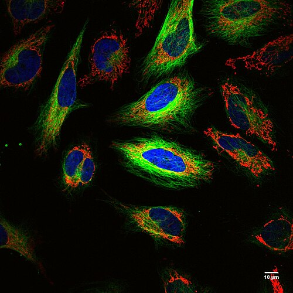
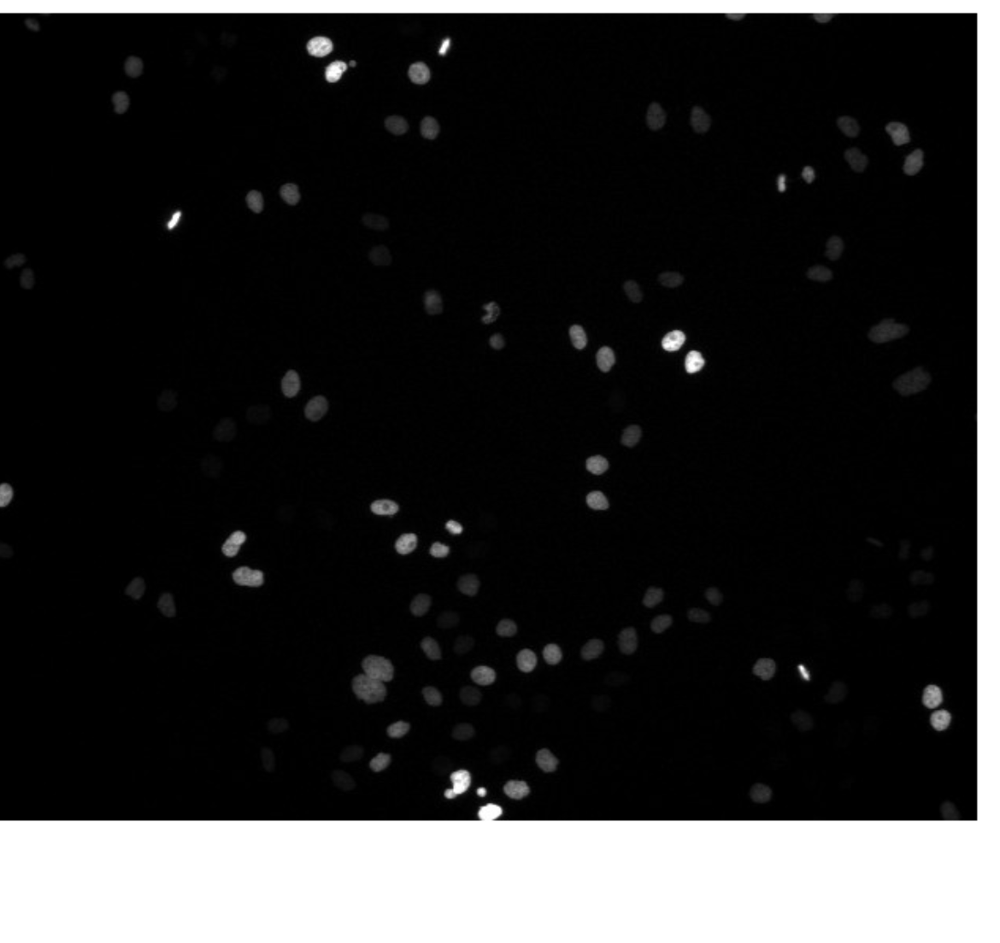
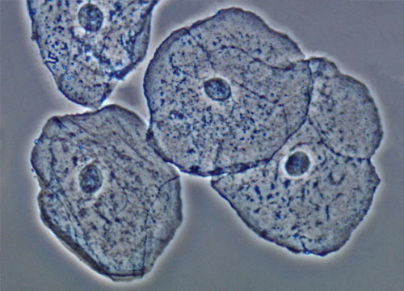
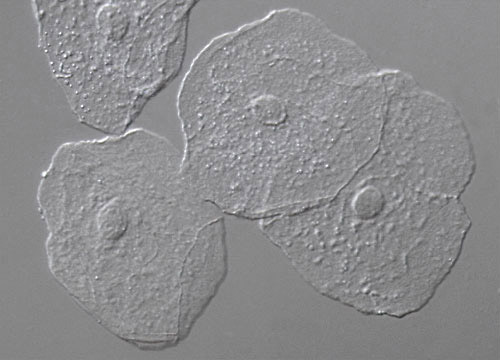

:::::::::::::::::::::::::::::::::::::: questions

- Why is image processing important in modern biology?
- Why can images be considered scientific data?
- What kinds of biological questions can image processing help answer?
- Why is manual analysis often insufficient?

::::::::::::::::::::::::::::::::::::::::::::::::

::::::::::::::::::::::::::::::::::::: objectives

- Describe the role of image processing in biological research.
- Recognise images as quantitative scientific data.
- Explain why automated image analysis is often required.
- Identify common biological applications of image analysis.

::::::::::::::::::::::::::::::::::::::::::::::::

## Introduction

{alt='Multicolour fluorescence microscopy image of living HeLa cells. Different fluorescent labels highlight distinct cellular structures.'}

Microscopy is one of the most important tools in biological research.

Modern microscopes can rapidly generate enormous quantities of image data.
Researchers routinely acquire hundreds, thousands, or even millions of images
during a single experiment.

As image datasets increase in size and complexity, manual analysis becomes
increasingly impractical.

Image processing provides tools that allow us to:

- extract quantitative information
- identify patterns
- automate repetitive tasks
- perform reproducible measurements
- analyse large datasets efficiently

Throughout this lesson we will learn how images can be treated as scientific
data rather than simply as pictures.

## Images Are Data

Consider the following biological questions:

- How many cells are present in an image?
- What is the average size of the nuclei?
- How much GFP fluorescence is present in each cell?
- How does cell morphology change following treatment?
- Does a mutant differ from a control population?

All of these questions can be answered using information contained within
images.

Images are therefore much more than visual records.

They are measurements.

::::::::::::::::::::::::::::::::::::: challenge

Think of a microscopy experiment that you have previously performed.

What measurements could be extracted from the resulting images?

Possible examples include:

- cell counts
- fluorescence intensity
- object size
- object shape
- distances between objects

:::::::::::::::::::::::: solution

There is no single correct answer.

Any quantitative property that can be measured from image pixels may be used
for biological analysis.

:::::::::::::::::::::::::::::::::

::::::::::::::::::::::::::::::::::::::::::::::::

## Why Not Simply Count Everything By Hand?

Suppose you wish to count cells/nuclei in the image below.

{alt="DAPI stained nuclei"}


You may be able to count:

- 10 cells
- 100 cells
- perhaps even 1,000 cells

manually.

But what if your experiment contains:

- `1000 images` consisting of `500 cells` each?


You would need to identify and count: `500,000 cells`


Manual analysis becomes:

- slow
- expensive
- difficult to reproduce
- prone to human error

Automated image analysis allows these measurements to be performed rapidly and
consistently.

## Reproducibility

Suppose two researchers independently count cells in the same image.

Will they obtain identical results?

Perhaps not.

Humans make subjective decisions about:

- object boundaries
- image quality
- weak fluorescence signals
- overlapping objects

Image-analysis workflows allow us to document exactly how measurements were
performed.

This improves reproducibility and transparency.

::::::::::::::::::::::::::::::::::::: callout

## Reproducibility Is A Scientific Requirement

A key goal of image analysis is not simply to work faster.

It is to produce measurements that can be reproduced, inspected, and verified.

See [1,500 ScientistsLift teh Lid on Reproducibility](https://doi.org/10.1038/533452a) paper for an introduction to the reproducibility crisis.

::::::::::::::::::::::::::::::::::::::::::::::::

## Common Applications of Bioimage Analysis

Image processing is used throughout the life sciences.

Examples include:

- ### Cell Counting
  Determining the number of cells in a field of view.

- ### Cell Segmentation
  Identifying individual cells or nuclei.

- ### Fluorescence Quantification
  Measuring gene expression or protein localisation.

- ### Time-Lapse Imaging
  Tracking cell movement over time.

- ### High-Content Screening
  Analysing thousands of images generated during drug-discovery experiments.

- ### Spatial Biology
  Measuring the organisation of cells and tissues.

## Example: Measuring Cell Size

Imagine we wish to compare cell size between two experimental conditions.

One approach might be:

1. Acquire microscopy images.
2. Identify individual cells.
3. Measure cell area.
4. Compare measurements statistically.

The resulting analysis is based on quantitative measurements rather than visual
impressions.

This distinction is important.

Scientists should avoid conclusions based solely on whether images "look"
different.

Whenever possible, observations should be supported by quantitative evidence.

## A First Look At Automation

Computers do not recognise:

- cells
- nuclei
- bacteria

in the same way humans do.

Instead, they work with numerical values associated with image pixels.

In later lessons we will learn how to:

- filter images
- segment objects
- measure features
- extract statistics

and turn image data into biological knowledge.

::::::::::::::::::::::::::::::::::::: challenge

Which of the following tasks would benefit from automated image analysis?

1. Measuring fluorescence intensity in 10,000 cells
2. Counting bacteria in 500 images
3. Measuring organoid size in a screening experiment
4. All of the above

:::::::::::::::::::::::: solution

The correct answer is:

```text
4. All of the above
```

Image analysis becomes increasingly valuable as datasets grow in size.

:::::::::::::::::::::::::::::::::

::::::::::::::::::::::::::::::::::::::::::::::::

## Discussion

{alt="Images of human cheek cells with phase contrast" width="45%"} {alt="Images of human cheek cells with DIC" width="45%"}
---

**Human Cells viewed with Phase and differential Interference Contrast**

---

Image analysis is sometimes viewed as a purely computational discipline.

However, image-analysis workflows are fundamentally scientific workflows.

Successful analyses require:

- biological understanding
- experimental design
- image acquisition expertise
- computational methods

The most useful measurements are those that answer meaningful biological
questions.

## Looking Ahead

In the next lesson we will begin exploring how computers represent images as
numerical arrays.

Understanding this representation is the foundation for all subsequent image
analysis methods.

## Key Points

::::::::::::::::::::::::::::::::::::: keypoints

- Microscopy images are scientific data.
- Modern experiments often generate more images than can be analysed manually.
- Image processing enables quantitative and reproducible measurements.
- Automated analysis improves consistency and scalability.
- Biological questions should drive image-analysis workflows.
- Images contain information that can be converted into quantitative measurements.
- **Images are n-dimensional matrices of numbers!**

::::::::::::::::::::::::::::::::::::::::::::::::
