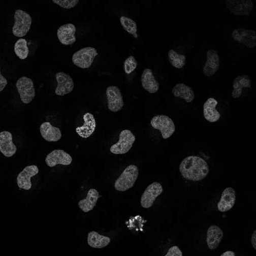
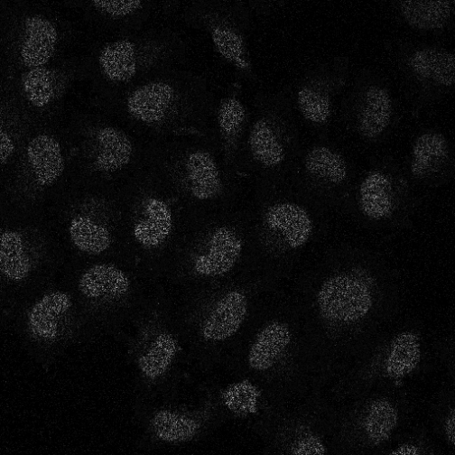
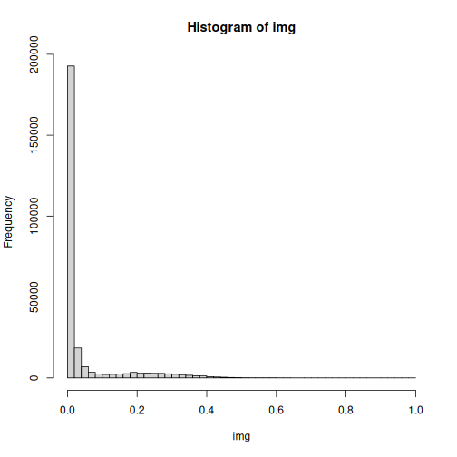
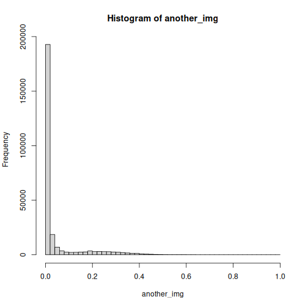

:::::::::::::::::::::::::::::::::::::: questions

- How are microscopy images stored on disk?
- What image file formats are commonly used in bioimage analysis?
- What is the difference between lossless and lossy compression?
- How can images be read into R?

::::::::::::::::::::::::::::::::::::::::::::::::

::::::::::::::::::::::::::::::::::::: objectives

- Load images into R using EBImage.
- Compare common image file formats.
- Distinguish between lossless and lossy compression.
- Explain why TIFF and OME-TIFF are preferred for quantitative image analysis.
- Inspect the dimensions and pixel values of image data.

::::::::::::::::::::::::::::::::::::::::::::::::

## Introduction

In the previous lesson we learned that digital images are numerical arrays.

Those arrays must be stored somewhere. When an image is saved to disk, the
pixel data are stored inside an image file format.

Many image file formats exist, but not all are equally suitable for scientific
image analysis.

Choosing an inappropriate image format can permanently alter image data and
affect quantitative measurements.

In this lesson we will learn how image files are stored, how to read them into
R, and how image formats can influence downstream analysis.

## Common Image File Formats

You may already be familiar with several image file formats.

| Format | Typical Use | Quantitative Analysis |
|----------|----------|----------|
| JPEG (.jpg) | Photographs | Usually not recommended |
| PNG (.png) | Graphics and screenshots | Often acceptable |
| TIFF (.tif) | Scientific imaging | Recommended |
| OME-TIFF (.ome.tif) | Microscopy images and metadata | Preferred |

Some formats prioritise small file size.

Others prioritise preservation of image information.

For scientific image analysis, preserving image information is usually more
important than reducing file size.

::::::::::::::::::::::::::::::::::::: callout

## Scientific Images Are Measurements

Microscopy images are not simply pictures.

Each pixel represents a measurement made by a detector.

Altering pixel values can alter the outcome of quantitative analyses.

::::::::::::::::::::::::::::::::::::::::::::::::

## Compression

Many image formats use compression to reduce file size.

Compression can be divided into two broad categories:

### Lossless Compression

Lossless compression reduces file size without changing pixel values.

```text
Original image -> Compressed image -> Recovered image

The Pixel values are unchanged
```

Common examples include:

- PNG
- TIFF with LZW compression
- OME-TIFF

### Lossy Compression

Lossy compression achieves greater file size reductions by modifying image data.

```text
Original image -> Compressed image -> Recovered image

The Pixel values are altered
```

The most common example is:

- JPEG

JPEG compression is excellent for photographs intended for visual inspection.

It is often inappropriate for quantitative microscopy.

## Reading Images with EBImage

The EBImage package provides functions for reading and displaying images. EBImage provides general purpose functionality for image processing and analysis. In the context of (high-throughput) microscopy-based cellular assays, EBImage offers tools to segment cells and extract quantitative cellular metrics.

The EBImage library was installed as part of the conda environment that you initially setup. 


``` r
library(EBImage)

packageVersion("EBImage")
```

``` output
[1] '4.54.0'
```

Read (assign) a TIFF image to an R object using the `readImage()` function provided by EBImage.


``` r
img <- readImage(
  "data/03-reading-bioimages/cells-original.tif"
)
```

``` warning
Warning in readTIFF(x, all = all, ...): TIFFReadDirectory: Unknown field with
tag 50838 (0xc696) encountered
```

``` warning
Warning in readTIFF(x, all = all, ...): TIFFReadDirectory: Unknown field with
tag 50839 (0xc697) encountered
```

 and Display the image:


``` r
display(img)
```


The image is now stored in R as a numerical array.

## Inspecting Image Dimensions

EBImage uses the `Image` class to store and process images. 
Images are stored as multi-dimensional arrays containing the pixel intensities 
and a `colorMode` that determines whether the underlying image data are `Color` or `Grayscale`. 
In either mode, the first two dimensions of the underlying array are understood to be the X & Y spatial dimensions of the image. 
In the `Grayscale` mode the remaining dimensions contain other image frames (e.g. Channels, Time, Z, etc.).  
In the `Color` mode, the third dimension contains color channels of the image (usually R,G,B), while higher dimensions contain image frames that represent other dimensions. We can examine the dimensions of an image.


``` r
dim(img)
```

``` output
[1] 512 512
```

The output depends on the image.

Examples include:

```text
512 x 512
```

for a grayscale image and

```text
512 x 512 x 3
```

for a three-channel image.

We can also inspect pixel values.


``` r
range(img)
```

``` output
[1] 0 1
```


``` r
summary(as.vector(img))
```

``` output
    Min.  1st Qu.   Median     Mean  3rd Qu.     Max. 
0.000000 0.000000 0.007843 0.046123 0.023529 1.000000 
```

The exact values depend on the image and its bit depth.  

You may have noticed somethig 
strange about the values that are returned when asking for the image's range. 

Although microscope detectors typically record pixel intensities as integers 
(for example values between 0 and 255 for 8-bit images or 0 and 65,535 for 16-bit images), 
image analysis libraries such as EBImage often convert these values to floating-point 
numbers between 0 and 1 when images are loaded into memory. 
This process is known as normalisation. For example, in a 16-bit image, 
a pixel value of 32,768 would be represented internally as approximately 0.5, in a 8-bit image, 
a pixel value of 0.5 in the converted image would correspond to ~128. 
Working with normalised floating-point values provides a consistent representation 
regardless of the original bit-depth of the image and simplifies many image-processing operations. 
A value of 0 always represents the minimum intensity in the image's dynamic range, 
while a value of 1 represents the maximum intensity. Importantly, 
this conversion preserves the relative intensity relationships between pixels, 
ensuring that quantitative measurements remain valid while providing a common numerical scale for analysis.

## A Comparison of File Formats

Suppose the same image data has been saved in three different file formats:

```text
cells-original.tif
cells-lossless.png
cells-lossy.jpg
```

Load each file.


``` r
img_tif <- img

img_png <- readImage(
  "data/03-reading-bioimages/cells-lossless.png"
)

img_jpg <- readImage(
  "data/03-reading-bioimages/cells-lossy.jpg"
)
```

Display the images.


``` r
display(img_tif)
```


``` r
display(img_png)
```


``` r
display(img_jpg)
```



At first glance they may appear very similar.

However, quantitative analysis requires us to look beyond visual appearance.

## Comparing Pixel Values

Compare the TIFF and PNG versions. We can use base R's `all()` function to ask whether all 
values are TRUE in an R vector or array.


``` r
all(img_tif == img_png)
```

``` output
[1] TRUE
```

Because PNG uses lossless compression, pixel values may be preserved exactly. 
Depending on implementation, conversion to png may result in a change from a grayscale 
to an rgb color image. In this case, the images would be different. 

Now compare TIFF and JPEG. 


``` r
all(img_tif == img_jpg)
```

``` output
[1] FALSE
```

JPEG compression modifies pixel values.

As a result, exact equality is unlikely.

::::::::::::::::::::::::::::::::::::: challenge

Why might two images appear visually identical but contain different pixel
values?

:::::::::::::::::::::::: solution

Human vision is relatively insensitive to many subtle pixel-level changes.

Compression algorithms such as JPEG deliberately remove information that is
unlikely to be noticed visually.

Quantitative image analysis, however, operates directly on pixel values and can
be affected by these changes.

:::::::::::::::::::::::::::::::::

::::::::::::::::::::::::::::::::::::::::::::::::

## Visualising Compression Differences

We can calculate the difference between two images.


``` r
difference <- abs(
  img_tif - img_jpg
)
```

Display the difference image.


``` r
display(
  normalize(difference)
)
```



Although the JPEG image may look very similar to the original, the difference
image reveals where pixel values have been modified.

This demonstrates why lossy compression can be problematic for scientific
analysis.

## Which Format Should I Use?

For bioimage analysis, TIFF is often a good choice because:

- it supports high bit depth images
- it supports lossless compression
- it is widely supported

Many microscopy workflows now use OME-TIFF.

OME-TIFF combines:

```text
Image pixels  +  Image metadata
```

within a single standardised file.

Metadata may include:

- pixel size
- objective lens
- channel names
- microscope settings
- acquisition parameters

We will explore metadata in the next lesson.

::::::::::::::::::::::::::::::::::::: challenge

A collaborator emails you a JPEG image exported from PowerPoint and asks you to
measure fluorescence intensity.

What concerns might you have?

:::::::::::::::::::::::: solution

The JPEG image may have been compressed using a lossy algorithm.

Pixel values may have been altered during export.

Quantitative measurements derived from the JPEG image may not reflect the
original microscopy data.

Ideally the original microscopy file, TIFF, or OME-TIFF should be used instead.

:::::::::::::::::::::::::::::::::

::::::::::::::::::::::::::::::::::::::::::::::::

::::::::::::::::::::::::::::::::::::: challenge

If two images have the same image histogram, does that mean the images are identical?

:::::::::::::::::::::::: solution

The R Code below displays the `img` Image, shuffles its values and assigns this new matrix 
to another Image, `another_img`, then displays `another_img` and calculates both of their 
histograms. Note that althrough the histograms are identical, the images are completely different.


``` r
display(img)
```


``` r
another_img <- Image(matrix(sample(img), nrow = nrow(img), ncol = ncol(img)))

display(another_img)
```


``` r
graphics::hist(img, breaks = 50)
```



``` r
graphics::hist(another_img, breaks = 50)
```




:::::::::::::::::::::::::::::::::

::::::::::::::::::::::::::::::::::::::::::::::::

## Looking Ahead

We can now read image files into R and understand some of the strengths and
limitations of common image formats.

In the next lesson we will examine image metadata and learn why information such
as pixel size, magnification, and acquisition settings are essential for
quantitative microscopy.

## Key Points

::::::::::::::::::::::::::::::::::::: keypoints

- Images are stored using a variety of file formats.
- TIFF and OME-TIFF are commonly used in scientific imaging.
- PNG uses lossless compression.
- JPEG uses lossy compression and changes pixel values.
- Quantitative image analysis depends on preserving image information.
- EBImage can read and display microscopy images.
- OME-TIFF stores both image data and microscopy metadata.

::::::::::::::::::::::::::::::::::::::::::::::::
