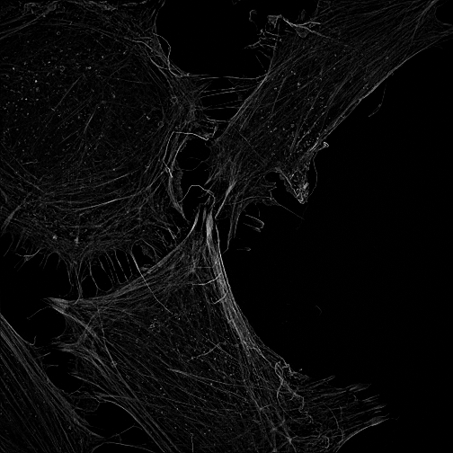

:::::::::::::::::::::::::::::::::::::: questions

- What is metadata?
- Why is metadata important in microscopy?
- How do pixel measurements relate to physical measurements?
- What is OME-TIFF?
- What is Bio-Formats?
- What information is retained when images are loaded into EBImage?

::::::::::::::::::::::::::::::::::::::::::::::::

::::::::::::::::::::::::::::::::::::: objectives

- Define metadata and explain its importance.
- Identify common microscopy metadata fields.
- Explain the relationship between pixels and physical units.
- Describe the purpose of OME-TIFF.
- Describe the role of Bio-Formats in microscopy image analysis.
- Compare Image and AnnotatedImage concepts.
- Recognise why metadata preservation is essential for reproducible research.

::::::::::::::::::::::::::::::::::::::::::::::::

## Introduction

In the previous lesson we learned how microscopy images can be stored and read
into R.

However, image pixels alone are rarely sufficient for scientific analysis.

To interpret image data correctly we must also understand how those images were
acquired.

This information is known as **metadata**.

Metadata are often defined as:

`Data about data` *or* `Data that Describe Data`


In microscopy, metadata can be just as important as the pixel values
themselves.

## What Is Metadata?

Consider a photograph taken with a smartphone.

The image contains pixels with intensity values, but the file may also contain:

- camera model
- date and time
- GPS location
- exposure settings

These are examples of metadata.  Photos use a metadata model known as EXIF.

Microscopy images are similar.

The image contains the measured signal, while metadata describe how those
measurements were acquired.

::::::::::::::::::::::::::::::::::::: challenge

Which of the following are examples of metadata?

1. Pixel intensity values
2. Objective magnification
3. Detector exposure time
4. Channel names

:::::::::::::::::::::::: solution

The correct answers are:

```text
2. Objective magnification
3. Detector exposure time
4. Channel names
```

Pixel intensity values are image data, not metadata.

:::::::::::::::::::::::::::::::::

::::::::::::::::::::::::::::::::::::::::::::::::

## Common Microscopy Metadata

Modern imaging experiments generate large amounts of metadata.

To improve reproducibility and data sharing, the bioimaging community developed
[**REMBI**](https://www.ebi.ac.uk/bioimage-archive/rembi-help-overview/) (*Recommended Metadata for Biological Images*), which provides
guidance on the information that should accompany image datasets.

REMBI covers many different imaging modalities and experimental workflows. For
our purposes, it is useful to think about microscopy metadata as belonging to
several broad categories.

### Sample Metadata

Information describing what was imaged.

Examples include:

- organism
- tissue or cell type
- experimental condition
- fluorescent labels
- staining protocols
- sample preparation methods

### Image Acquisition Metadata

Information describing how the image was acquired.

Examples include:

- microscope type
- objective magnification
- numerical aperture
- detector type
- laser wavelengths
- exposure times
- detector gain

### Image Structure Metadata

Information describing the structure of the image data.

Examples include:

- image dimensions
- number of channels
- number of z-planes
- number of timepoints
- bit-depth

### Spatial Calibration Metadata

Information required to convert pixels into physical measurements.

Examples include:

- pixel size
- physical units

### Provenance Metadata

Information describing the history of the dataset.

Examples include:

- acquisition date
- operator
- analysis software
- processing steps
- dataset identifiers

::::::::::::::::::::::::::::::::::::: callout

## REMBI and Reproducibility

REMBI promotes the collection and sharing of metadata needed to understand,
reproduce, and reuse biological imaging experiments.

In practice, researchers may record more or less metadata than listed here. These
examples represent some of the most commonly encountered metadata during image
analysis workflows.

## Metadata Enable Reproducibility

Without metadata it can be impossible to determine exactly how an image was
acquired.

Good metadata are essential for reproducible scientific image analysis.

As an example, pixels are not physical units. We need to know both the number 

of pixels a feature occupies as well as the physical area of each pixel in order

to calculate the feature's area.

::::::::::::::::::::::::::::::::::::::::::::::::


## Why Metadata Matter

Consider two images.

### Image A

```text
Pixel size = 1.0 µm
```

### Image B

```text
Pixel size = 0.1 µm
```

In both images a nucleus occupies:

```text
5000 pixels
```

Are the nuclei the same size?

No.

The same number of pixels corresponds to very different physical dimensions
because the pixel sizes differ.

Without metadata the measurements cannot be interpreted correctly.

## OME-TIFF: Images Plus Metadata

[The Open Microscopy Environment (OME)](https://openmicroscopy.com) developed OME-TIFF to provide a
standardised way of storing microscopy images together with the metadata needed
to interpret them.

 An OME-TIFF file contains:

`Image Pixels + Metadata`

Metadata stored within an OME-TIFF file may include:

- pixel sizes
- voxel dimensions
- channel names
- objective information
- exposure times
- detector settings
- acquisition dates

Unlike formats such as JPEG, OME-TIFF was designed specifically for scientific
imaging workflows.

::::::::::::::::::::::::::::::::::::: callout

## Why OME-TIFF Matters

OME-TIFF stores both image data and metadata in a standard format that can be
shared between software platforms.

::::::::::::::::::::::::::::::::::::::::::::::::

## Introducing Bio-Formats

Microscopy images are produced by many different microscope manufacturers.

Examples include:

- Zeiss `.czi`
- Nikon `.nd2`
- Leica `.lif`
- Olympus `.vsi`

Each format stores image data and metadata slightly differently.

The [Open Microscopy Environment](https://openmicroscopy.org) developed **Bio-Formats**, an open-source
software library capable of reading a large number of microscopy file formats.

Bio-Formats provides a common interface for accessing both image data and
metadata.

Many popular software tools use Bio-Formats internally, including:

- Fiji
- OMERO
- QuPath
- RBioFormats

::::::::::::::::::::::::::::::::::::: callout

## Why Bio-Formats Matters

Bio-Formats allows scientists to access image data and metadata from many
different microscope systems without relying on vendor-specific software.

::::::::::::::::::::::::::::::::::::::::::::::::

## RBioFormats

The R package **RBioFormats** provides access to Bio-Formats from within R.

Unlike EBImage, which focuses primarily on the image data for image processing and analysis,
RBioFormats was designed to provide access to microscopy image metadata as well
as image data.

Throughout this lesson we will continue to use EBImage because it provides a
simple and accessible environment for learning image-analysis concepts.

## Image versus AnnotatedImage

Images can be represented in different ways by different software packages.

When an image is loaded using EBImage in R it is represented as an
`Image` object.

```text
Image 
  colorMode    : Color 
  storage.mode : double 
  dim          : 2560 2560 3 2 
  frames.total : 6 
  frames.render: 2 

imageData(object)[1:5,1:6,1,1]
            [,1]        [,2]         [,3]         [,4]         [,5]
[1,] 0.032379644 0.022171359 0.0080872816 0.0056305791 0.0065613794
[2,] 0.021667811 0.014892805 0.0055695430 0.0043640803 0.0046997787
[3,] 0.007522698 0.005325399 0.0021515221 0.0019684138 0.0017547875
[4,] 0.002502480 0.001998932 0.0010833906 0.0005188067 0.0003814755
[5,] 0.002090486 0.001586938 0.0007934691 0.0003204395 0.0001525902
             [,6]
[1,] 0.0055848020
[2,] 0.0036926833
[3,] 0.0012359808
[4,] 0.0002288853
[5,] 0.0001678492
```

Conceptually:

```text
Image
|
└── Pixel Array
```

The object primarily stores image data.

In contrast, when an image is loaded using RBioFormats in R it is represented as an
`AnnotatedImage` object:

```text
AnnotatedImage 
  colorMode    : Color 
  storage.mode : double 
  dim          : 2560 2560 2 
  dimorder     : x y c 
  frames.total : 2 
  frames.render: 1 

imageData(object)[1:5,1:6,1]
            [,1]        [,2]         [,3]         [,4]         [,5]
[1,] 0.032379644 0.022171359 0.0080872816 0.0056305791 0.0065613794
[2,] 0.021667811 0.014892805 0.0055695430 0.0043640803 0.0046997787
[3,] 0.007522698 0.005325399 0.0021515221 0.0019684138 0.0017547875
[4,] 0.002502480 0.001998932 0.0010833906 0.0005188067 0.0003814755
[5,] 0.002090486 0.001586938 0.0007934691 0.0003204395 0.0001525902
             [,6]
[1,] 0.0055848020
[2,] 0.0036926833
[3,] 0.0012359808
[4,] 0.0002288853
[5,] 0.0001678492

metadata
 $ coreMetadata  :List of 18
 $ globalMetadata:List of 502
 ```

Conceptually:

```text
AnnotatedImage
|
├── Pixel Array
└── Metadata
    |
    ├── Pixel Size
    ├── Channel Names
    ├── Acquisition Settings
    └── Instrument Information
```

`AnnotatedImage` objects preserve the relationship between image data and metadata.

::::::::::::::::::::::::::::::::::::: callout

## Image Data and Metadata

A useful way to think about microscopy files is:

```text
Image Data + Metadata = Biological Meaning
```

Both components are required for quantitative image analysis.

::::::::::::::::::::::::::::::::::::::::::::::::

## What Happens When We Read an OME-TIFF with EBImage?

Load an OME-TIFF file using EBImage.


``` r
library(EBImage)

img <- readImage(
  "data/04-microscopy-metadata/Actin.ome.tif"
)
```

``` warning
Warning in readTIFF(x, all = all, ...): TIFFReadDirectory: Incorrect count for
"ColorMap"; tag ignored
```

Interrogate & display the object and some of its parameters:


``` r
img
```

``` output
Image 
  colorMode    : Grayscale 
  storage.mode : double 
  dim          : 2560 2560 
  frames.total : 1 
  frames.render: 1 

imageData(object)[1:5,1:6]
            [,1]        [,2]         [,3]         [,4]         [,5]
[1,] 0.032379644 0.022171359 0.0080872816 0.0056305791 0.0065613794
[2,] 0.021667811 0.014892805 0.0055695430 0.0043640803 0.0046997787
[3,] 0.007522698 0.005325399 0.0021515221 0.0019684138 0.0017547875
[4,] 0.002502480 0.001998932 0.0010833906 0.0005188067 0.0003814755
[5,] 0.002090486 0.001586938 0.0007934691 0.0003204395 0.0001525902
             [,6]
[1,] 0.0055848020
[2,] 0.0036926833
[3,] 0.0012359808
[4,] 0.0002288853
[5,] 0.0001678492
```

``` r
dim(img)
```

``` output
[1] 2560 2560
```

``` r
range(img)
```

``` output
[1] 0 1
```

``` r
display(img)
```


The image can be analysed successfully.

However, the resulting object primarily represents *only* the image pixel data.

::::::::::::::::::::::::::::::::::::: spoiler

### Try RBioFormats

The `RBioFromats` library provides an equivalent function to the `EBImage readImage()` 
function: `read.image()`.

We don't use it here due to RBioFormats dependence on Java and the resulting headaches 
this can cause. I have included it in the environment file used when you created 
your conda environment. Provided you have a system wide java available, the following 
code **should** work.

Try it to see if it works in your Jupyter environment:


``` r
library(RBioFormats)
```

``` output
BioFormats library version 7.3.0
```

``` r
bio_img <- read.image(
  "data/04-microscopy-metadata/Actin.ome.tif"
)

bio_img
```

``` output
AnnotatedImage 
  colorMode    : Grayscale 
  storage.mode : double 
  dim          : 2560 2560 
  dimorder     : x y 
  frames.total : 1 
  frames.render: 1 

imageData(object)[1:5,1:6]
      y
x             [,1]        [,2]         [,3]         [,4]         [,5]
  [1,] 0.032379644 0.022171359 0.0080872816 0.0056305791 0.0065613794
  [2,] 0.021667811 0.014892805 0.0055695430 0.0043640803 0.0046997787
  [3,] 0.007522698 0.005325399 0.0021515221 0.0019684138 0.0017547875
  [4,] 0.002502480 0.001998932 0.0010833906 0.0005188067 0.0003814755
  [5,] 0.002090486 0.001586938 0.0007934691 0.0003204395 0.0001525902
      y
x              [,6]
  [1,] 0.0055848020
  [2,] 0.0036926833
  [3,] 0.0012359808
  [4,] 0.0002288853
  [5,] 0.0001678492

metadata
 $ coreMetadata:List of 18
```

``` r
dim(bio_img)
```

``` output
[1] 2560 2560
```

``` r
range(bio_img)
```

``` output
[1] 0 1
```

``` r
display(bio_img)
```


::::::::::::::::::::::::::::::::::::::::::::::::::

## Image Data and Metadata Become Separated

It can be helpful to think about the process as:

```text
OME-TIFF
|
├── Image Pixels
└── Metadata
```

↓

```text
EBImage Image Object
|
└── Pixel Array
```

The image data are loaded into memory and become available for analysis.

The metadata remain stored in the original file but are not typically exposed
through the EBImage `Image` object itself. Metadata are, however, 
available in the `AnnotatedImage` object created when you load an image using the
`RBioFormats read.image()` function.

::::::::::::::::::::::::::::::::::::: challenge

An OME-TIFF file contains:

- image pixels
- pixel size information
- channel names
- microscope settings

It is loaded using:

```r
img <- readImage("cells.ome.tif")
```

Which information is guaranteed to be available through the resulting object?

1. Pixel data
2. Objective information
3. Exposure time
4. Channel metadata

Would it be different if we used the following command instead?

```r
img <- read.image("cells.ome.tif")
```


:::::::::::::::::::::::: solution

```text
1. Pixel data
```

EBImage (which provides the `readImage()` function) primarily works with image pixel data.

Additional metadata stored in the OME-TIFF file may not be directly available
through the resulting Image object.

If the image object is an `AnnotatedImage` because you loaded it with the read.image() 
function, then all of the pixel array information and metadata would be available 
in the image object.
:::::::::::::::::::::::::::::::::

::::::::::::::::::::::::::::::::::::::::::::::::

## Losing Metadata

Metadata can be lost when images are:

- exported to inappropriate formats
- copied into presentation software
- converted between file formats
- separated from their original acquisition files

Consider the workflow:

```text
Microscope Image -> OME-TIFF -> PNG
```

The PNG file may still contain a viewable image.

However, important metadata may no longer be available.

The image remains.

Critical scientific context may be lost.

::::::::::::::::::::::::::::::::::::: challenge

Why might exporting a microscopy image to PNG cause problems for future
analysis?

:::::::::::::::::::::::: solution

PNG files often lose important microscopy metadata.

Information such as calibration, acquisition settings, channel names, and
instrument information may no longer be preserved.

This makes reproducibility and quantitative analysis more difficult.

:::::::::::::::::::::::::::::::::

::::::::::::::::::::::::::::::::::::::::::::::::

## Looking Ahead

Metadata provide the information needed to interpret biological images
correctly.

Throughout the remainder of this course we will repeatedly combine:

```text
Image Data + Metadata
```

to obtain meaningful biological measurements.

In future lessons we will explore how image display, visualisation, and image
processing can alter our perception of an image while leaving the underlying
pixel data unchanged.

## Key Points

::::::::::::::::::::::::::::::::::::: keypoints

- Metadata describe how an image was acquired.
- Pixel measurements cannot be interpreted without calibration information.
- Pixel size enables conversion from pixels to physical units.
- OME-TIFF stores both image data and microscopy metadata.
- Bio-Formats provides a common interface for reading microscopy image formats.
- RBioFormats provides access to Bio-Formats from within R.
- EBImage primarily works with image pixel data.
- Image and AnnotatedImage objects have different goals.
- Metadata are essential for reproducible microscopy.
- Exporting images to inappropriate formats can result in metadata loss.

::::::::::::::::::::::::::::::::::::::::::::::::
