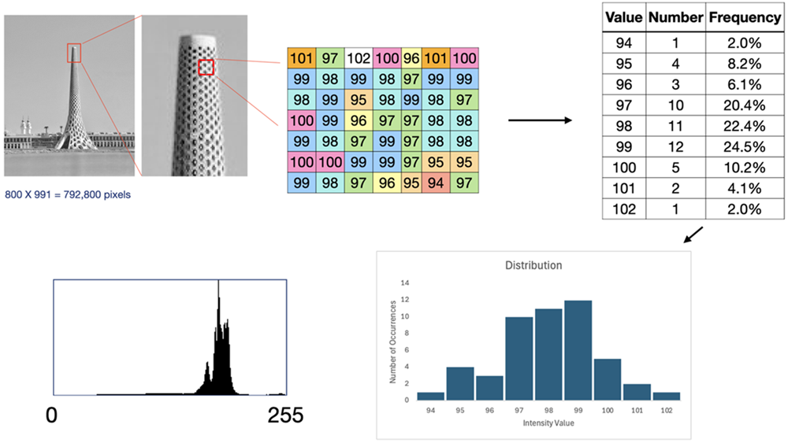

:::::::::::::::::::::::::::::::::::::: questions

- How are microscopy images displayed?
- What is the relationship between image data and image display?
- How can image contrast be adjusted?
- What do image histograms tell us about pixel intensities?
- What are lookup tables (LUTs)?

::::::::::::::::::::::::::::::::::::::::::::::::

::::::::::::::::::::::::::::::::::::: objectives

- Display images using EBImage.
- Explain the difference between image data and image display.
- Generate and interpret image histograms.
- Apply contrast stretching to improve image visualisation.
- Explain the purpose of lookup tables.
- Recognise when display changes do and do not alter image data.

::::::::::::::::::::::::::::::::::::::::::::::::

## Introduction

Microscopy images are ultimately collections of numerical measurements.

However, scientists rarely inspect raw pixel values directly.

Instead, we visualise image data by mapping pixel values to brightness and
colour on a computer screen.

A crucial concept in bioimage analysis is:

```text
Image Data ≠ Image Display
```

The same image data can be displayed in many different ways without changing a
single pixel value.

In this lesson we will explore how images are visualised and how display
choices affect our interpretation of microscopy data.

## Reading an Image

Load the EBImage package.


``` r
library(EBImage)
```

``` error
Error in `library()`:
! there is no package called 'EBImage'
```

Read an image.


``` r
img <- readImage(
  "data/05-visualising-bioimages/dimMito.ome.tif"
)
```

``` error
Error in `readImage()`:
! could not find function "readImage"
```

Display the image.


``` r
display(img)
```

``` error
Error in `display()`:
! could not find function "display"
```

This image is represented internally as a numerical array.

Let's inspect its dimensions.


``` r
dim(img)
```

``` error
Error:
! object 'img' not found
```

We can also examine the range of pixel values.


``` r
range(img)
```

``` error
Error:
! object 'img' not found
```

::::::::::::::::::::::::::::::::::::: callout

## A Reminder About Pixel Values

Earlier we learned that microscope detectors often record pixel intensities as
integers such as 8-bit values (0-255) or 16-bit values (0-65,535).

When images are loaded into EBImage, these values are typically normalised to
floating-point values between 0 and 1. This provides a consistent numerical
representation for image processing and visualisation, regardless of the
original bit-depth of the image.

::::::::::::::::::::::::::::::::::::::::::::::::

These pixel values form the underlying image data.

## Images Are Data

Each pixel contains a numerical value.

We can calculate simple summary statistics.


``` r
summary(as.vector(img))
```

``` error
Error:
! object 'img' not found
```

These numbers summarise the underlying pixel intensity values, 
regardless of how the image is displayed on screen.

::::::::::::::::::::::::::::::::::::: challenge

What information is lost if we only look at the displayed image and ignore the
pixel values?

:::::::::::::::::::::::: solution

The displayed image shows a visual representation of the data.

The underlying numerical pixel values, which are used for quantitative image
analysis, are not directly visible.

Measurements, segmentation, and image processing are performed on pixel values,
not the displayed image.

:::::::::::::::::::::::::::::::::

::::::::::::::::::::::::::::::::::::::::::::::::

## Why Some Images Look Dark

Many microscopy images contain useful information across a relatively narrow
range of intensities. The mitochondrial image (dimMito.ome.tif) you displayed 
earlier is a good example. In our mitochondrial image, the data range from 0 to 0.68


```text
0.00 ---------------- 0.68
```

A computer display often expects values spanning:

```text
0.00 ---------------- 1.00
```

As a result, many scientific images initially appear dark or low contrast. 
Our mitochondrial image only uses 2/3 of the total dynamic range that the screen can show.

Display software sometimes compensates for this by adjusting how pixel values are mapped
to screen brightness. Usually without explicitly mentioning how the values in the 
image are mapped to brightness on the screen. But sometimes not. Jupyter Lab does not.

## Histograms

Another way to visualise the same data is to look at the distribution of the data. 
Histograms show us the pixel intensity distributions within an
image, leaving out any spatial information. 

Create a histogram of the image pixels.


``` r
hist(
  as.vector(img),
  main = "Pixel Intensity Histogram",
  xlab = "Pixel Intensity"
)
```

``` error
Error:
! object 'img' not found
```

The histogram shows:

- the range of pixel values
- how frequently each value occurs
- whether intensities occupy a small or large fraction of the available range

::::::::::::::::::::::::::::::::::::: callout

## Histograms Describe Data

A histogram provides information about the image data itself.

Unlike image display settings, histograms are independent of the brightness/contrast settings 
used to visualise the image. The following image briefly describes how an image histogram is 
created from the underlying data.

{alt="flowchart showing image histogram constsruction"}

::::::::::::::::::::::::::::::::::::::::::::::::

## Contrast Stretching

Images often become easier to inspect when their contrast is adjusted.

Common approaches include contrast stretching or histogram equalization.

EBImage provides the `normalize()` and `equalize()` functions.

**Important** --- This does NOT change the underlying pixel values in most software. 
In R, we could change the pixel values by assigning the new object to the old object. 
Therefore, a common way to do this is to normalize the original image data and assign
this to a new object. You rarely want to change your raw data!


``` r
img_stretched <- normalize(img)
```

``` error
Error in `normalize()`:
! could not find function "normalize"
```

``` r
img_equalized <- equalize(img)
```

``` error
Error in `equalize()`:
! could not find function "equalize"
```

Display the enhanced images.


``` r
display(img_stretched)
```

``` error
Error in `display()`:
! could not find function "display"
```

``` r
display(img_equalized)
```

``` error
Error in `display()`:
! could not find function "display"
```

Compare the intensity ranges.

Original Image:

``` r
range(img)
```

``` error
Error:
! object 'img' not found
```

Streched Image:

``` r
range(img_stretched)
```

``` error
Error:
! object 'img_stretched' not found
```

Equalized Image:

``` r
range(img_equalized)
```

``` error
Error:
! object 'img_equalized' not found
```

The image appearance changes dramatically, but the biological structures remain
the same.

## Has the Data Changed?

Let's compare the original and stretched images.


``` r
par(mfrow = c(1, 3))

hist(
  as.vector(img),
  main = "Original",
  xlab = "Intensity"
)
```

``` error
Error:
! object 'img' not found
```

``` r
hist(
  as.vector(img_stretched),
  main = "Normalised",
  xlab = "Intensity"
)
```

``` error
Error:
! object 'img_stretched' not found
```

``` r
hist(
  as.vector(img_equalized),
  main = "Equalized",
  xlab = "Intensity"
)
```

``` error
Error:
! object 'img_equalized' not found
```

``` r
par(mfrow = c(1, 1))
```

Contrast enhancement changes how intensities are distributed across the display
range.

Importantly, it does not create new biological structures.

::::::::::::::::::::::::::::::::::::: challenge

The normalised/equalised image appears much clearer(?) than the original image.

Has new biological information been created?

:::::::::::::::::::::::: solution

No. but new biological insights may be gained with new visualisations.  

Contrast stretching or histogram equalisation changes how the image is displayed.

It can make structures easier to see, but it does not create new biological
features.

The information was already present in the original image.

:::::::::::::::::::::::::::::::::

::::::::::::::::::::::::::::::::::::::::::::::::

## Image Data versus Image Display

It is useful to think about image visualisation as a mapping process.

```text
Pixel Values in the image -> Display Mapping -> Visible Image on the screen
```

Different display mappings can produce very different visual appearances while
using exactly the same image data.

## Lookup Tables
A lookup table (LUT) defines how pixel intensities are displayed. It is the mapping 
function alluded to above that takes in a pixel intensity value and produces a display value.

For example:

`Low Intensity → Black ....... High Intensity → White`

produces a grayscale image.

You can imagine it as a table with two columns: one with the pixel value 
& one with the resulting display value.

|Image Value|Display Value|
|:-:|:-:|
|0|0|
|1|1|
|...|...|
|254|254|
|255|255|

Other LUTs may map intensities to:

- green
- magenta
- yellow
- red
- blue

or many other colour schemes. We can even use colour to indicate intensity 
rather than wavelength by mapping different intensity values to different colours.

A LUT changes appearance, not pixel values.

::::::::::::::::::::::::::::::::::::: challenge

Suppose the same fluorescence image is displayed using:

- grayscale
- green
- magenta

Which display contains the largest fluorescence intensity values?

:::::::::::::::::::::::: solution

All three displays contain exactly the same intensity values.

Only the mapping between intensity and colour has changed.

LUTs affect visual appearance but do not alter the image data.

:::::::::::::::::::::::::::::::::

::::::::::::::::::::::::::::::::::::::::::::::::

## Histograms Before and After Visualisation Changes

As we saw earlier, we can alter the image display by altering the display values 
in the histogram. 

In the case above, where we've displayed the image using a different LUT or contrast setting.

The image appearance may change dramatically.

However, the histogram remains the same unless the underlying pixel values are
modified.

*This distinction is extremely important throughout bioimage analysis.*

## A Note on Figure Preparation

When preparing figures for presentations or publications, investigators often
adjust:

- brightness
- contrast
- colour maps

These changes can improve interpretation and communication.

However, display adjustments should:

- be applied consistently
- preserve the underlying scientific information
- avoid obscuring or exaggerating image features

::::::::::::::::::::::::::::::::::::: callout

## Display Changes and Analysis

Quantitative image analysis should be performed on image data rather than the
appearance of a displayed image.

Always distinguish between modifications that affect visualisation and those
that alter pixel values.

::::::::::::::::::::::::::::::::::::::::::::::::

## Looking Ahead

In this lesson we changed how images were displayed.

The underlying pixel values remained unchanged.

In the next lesson we will begin performing image processing operations that
modify image data directly.

These operations will alter the image itself rather than simply changing how it
appears on screen.

## Key Points

::::::::::::::::::::::::::::::::::::: keypoints

- Microscopy images are numerical data.
- The same image data can be displayed in many different ways.
- Histograms summarise the distribution of pixel intensities.
- Contrast enhancement improves visibility without creating new biological information.
- Lookup tables change appearance but not intensity values.
- Image data and image display are distinct concepts.
- Quantitative image analysis relies on pixel values rather than image appearance.

::::::::::::::::::::::::::::::::::::::::::::::::
