:::::::::::::::::::::::::::::::::::::: questions

- What is the difference between grayscale and colour images?
- How does EBImage represent colour images?
- What is the difference between RGB images and fluorescence microscopy images?
- What are channels?
- What is pseudocolouring?

::::::::::::::::::::::::::::::::::::::::::::::::

::::::::::::::::::::::::::::::::::::: objectives

- Distinguish between grayscale and colour images.
- Describe RGB image representation.
- Use EBImage colour modes.
- Explain the difference between RGB colour channels and fluorescence channels.
- Explain pseudocolouring.
- Create colour composite images.

::::::::::::::::::::::::::::::::::::::::::::::::

## Introduction

In the previous lesson we learned that the same image data can be displayed in
many different ways.

We used lookup tables (LUTs) to assign *colours* to grayscale images without
changing the underlying pixel values.

This raises an important question:

```text
Where do the colours come from?
```

To answer this question we must first understand the difference between
**colour images** and **multi-channel microscopy images**.

Although they are often displayed similarly, they represent fundamentally
different kinds of data.

## Grayscale Images

Most microscopy images begin as grayscale images. Detectors on most advanced 
acquisition systems only detect photons, not their wavelengths. *By convention*, 
we assign the color black to low values and the color white to high values. 
The EBImage package contains some example images.
Let's Load an example. This is an example of a fluorescence micrograph of cells growing
in culture fixed and stained with the DNA binding dye - DAPI. 


``` r
library(EBImage)

img <- readImage(
  system.file("images", "nuclei.tif", package = "EBImage"))
  #Select a single frame for demonstration purposes. The dataset contains four images
  img <- img[,,1]
```

Display the image.


``` r
display(img)
```


Determine its colour mode. EBImage has two color modes. Mode 0 is `Grayscale` and 
Mode 2 is `Color`. You can find the colormode with the `colorMode()` function or by 
typing the name of the image object and running the cell to see the object's information. 
You can also use the base R function `str()`. 


``` r
colorMode(img)
```

``` output
[1] 0
```

``` r
img
```

``` output
Image 
  colorMode    : Grayscale 
  storage.mode : double 
  dim          : 510 510 
  frames.total : 1 
  frames.render: 1 

imageData(object)[1:5,1:6]
           [,1]       [,2]       [,3]       [,4]       [,5]       [,6]
[1,] 0.06274510 0.07450980 0.07058824 0.08235294 0.10588235 0.09803922
[2,] 0.06274510 0.05882353 0.07843137 0.09019608 0.09019608 0.10588235
[3,] 0.06666667 0.06666667 0.08235294 0.07843137 0.09411765 0.09411765
[4,] 0.06666667 0.06666667 0.07058824 0.08627451 0.08627451 0.09803922
[5,] 0.05882353 0.06666667 0.07058824 0.08235294 0.09411765 0.10588235
```

``` r
str(img)
```

``` output
Formal class 'Image' [package "EBImage"] with 2 slots
  ..@ .Data    : num [1:510, 1:510] 0.0627 0.0627 0.0667 0.0667 0.0588 ...
  .. ..- attr(*, "dimnames")=List of 2
  .. .. ..$ : NULL
  .. .. ..$ : NULL
  ..@ colormode: int 0
  ..$ dim     : int [1:2] 510 510
  ..$ dimnames:List of 2
  .. ..$ : NULL
  .. ..$ : NULL
```

A grayscale image stores a single intensity value for every pixel.

Each pixel contains one numerical measurement.

## Colour Models

Before discussing RGB images, it is useful to understand that there are
different ways of creating colour.

Two common colour models are:

```text
Additive Colour
```
&

```text
Subtractive Colour
```

### Additive Colour

Additive colour is used by devices that emit light, such as:

- computer monitors
- televisions
- mobile phones
- projectors
- *fluorescence probes*

The additive colour model uses:


<span style="color: red;">Red</span>
<span style="color: green;">Green</span>
<span style="color: blue;">Blue</span>


light sources.

Colours are created by adding different amounts of red, green, and blue light
together.

For example:


<span style="color: red;">Red</span> + <span style="color: green;">Green</span> = <span style="color: yellow;">Yellow</span>

<span style="color: red;">Red</span> + <span style="color: blue;">Blue</span> = <span style="color: magenta;">Magenta</span>

<span style="color: green;">Green</span> + <span style="color: blue;">Blue</span> = <span style="color: cyan;">Cyan</span>

<span style="color: red;">Red</span> + <span style="color: green;">Green</span> + <span style="color: blue;">Blue</span> = <span style="color: white;">White</span>


The more light that is added, the brighter the resulting colour becomes.

This is why RGB is known as an **additive colour model**.
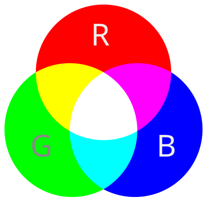{alt="RGB color circles mixing to secondary colors and white" width="256"}


### Subtractive Colour

Subtractive colour is used by materials that reflect light rather than emit it,
such as:

- printed photographs
- books
- magazines
- posters

The subtractive colour model uses:

<span style="color: cyan;">Cyan</span>
<span style="color: magenta;">Magenta</span>
<span style="color: yellow;">Yellow</span>


pigments or inks.

Instead of adding light, these colours work by absorbing (subtracting)
different wavelengths from white light.

For example:


<span style="color: cyan;">Cyan</span> + <span style="color: magenta;">Magenta</span> = <span style="color: blue;">Blue</span>

<span style="color: cyan;">Cyan</span> + <span style="color: yellow;">Yellow</span> = <span style="color: green;">Green</span>

<span style="color: magenta;">Magenta</span> + <span style="color: yellow;">Yellow</span> = <span style="color: red;">Red</span>

Combining all colours produces a very dark colour or black.

Because colours are created by removing light, this is known as a
**subtractive colour model**.

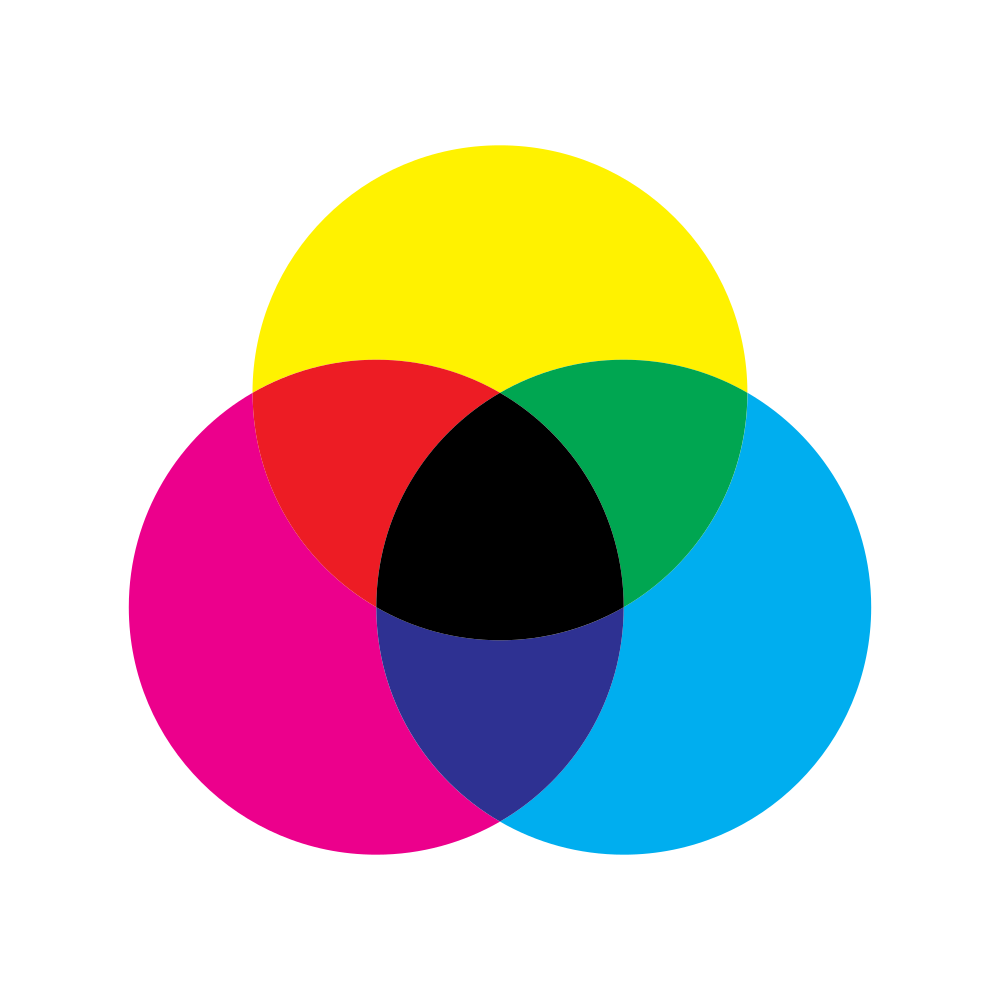{alt="CMY color circles combining in a subtractive manner" width="256"}

### Why RGB Matters for Image Analysis

Microscopy images are usually viewed on computer screens, which use the
additive RGB colour model.

As a result, colour images in software such as EBImage are typically represented
using three channels:

<span style="color: red;">Red</span>
<span style="color: green;">Green</span>
<span style="color: blue;">Blue</span>


These channels control the brightness of the red, green, and blue elements of
the display and together produce the colours that we see on screen.

## Creating an RGB Image

We can create an RGB image by combining three grayscale images.


``` r
rgb_img <- rgbImage(
  red = img,
  green = img,
  blue = img
)
```

Display the result.


``` r
display(rgb_img)
```

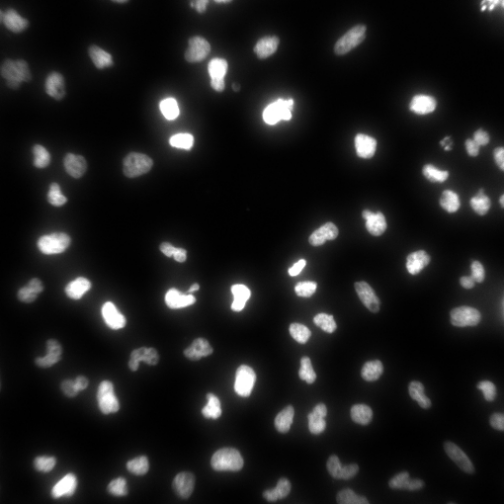

Determine its colour mode.


``` r
colorMode(rgb_img)
```

``` output
[1] 2
```

``` r
# or `rgb_img``or `str(rgb_img)`
```

Compare the dimensions between the greyscale and colour versions of the image. 


``` r
dim(img)
```

``` output
[1] 510 510
```


``` r
dim(rgb_img)
```

``` output
[1] 510 510   3
```

The additional dimension corresponds to the 3 colour channels.

::::::::::::::::::::::::::::::::::::: callout

## Colour Mode

EBImage distinguishes between grayscale and colour images using the
`colorMode()` function.

A grayscale image stores one intensity value per pixel.

A colour image stores three values per pixel. These are implicitly understood 
to represent the red, green, and blue components of a color image.

::::::::::::::::::::::::::::::::::::::::::::::::

## RGB Images Represent Colour

Many everyday image formats use the RGB colour model.

RGB stands for:

```text
Red Green Blue
```

Instead of storing a single intensity value for each pixel, RGB images store
three values:

```text
Pixel
|
├── Red
├── Green
└── Blue
```

These channels work together to produce the colours we see on screen.

Modern displays, including computer monitors, televisions, tablets, and mobile
phones, are built from tiny red, green, and blue light-emitting elements.

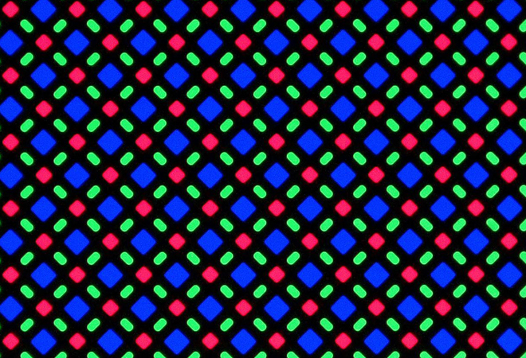{alt="individual rgb pixels on an iphone screen at 1000X." width="512"}

Although each screen pixel actually contains separate red, green, and blue
elements, they are extremely small. When viewed from a normal distance, our
eyes cannot resolve these individual components.

Instead, the light from the red, green, and blue elements blends together and
is perceived as a single colour.

RGB images are designed to exploit this property of human vision. For every
image pixel, the image stores three numerical values: one for red; one for green; 
and one for blue.


These values determine the brightness of the corresponding red, green, and blue
elements on the display.

The combination of these three colour channels produces the full-colour image
that we see on screen.

Conceptually:

```text
Red Channel + Green Channel + Blue Channel
                   ↓
                RGB Image
```

Load a colour image supplied with EBImage.


``` r
colour_img <- readImage(
  system.file(
    "images",
    "sample-color.png",
    package = "EBImage"
  )
)
```

Display the image.


``` r
display(colour_img)
```

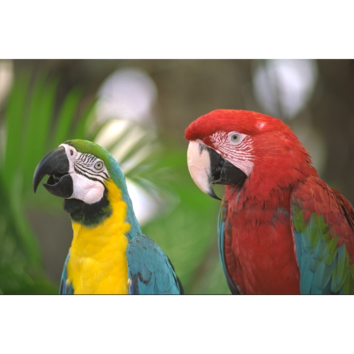

Note that the histogram of a colour image contains one distribution for each of 
the colour channels. The base R graphics version of the histogram function will sum 
all the values from each of the channels.

``` r
hist(colour_img)
```

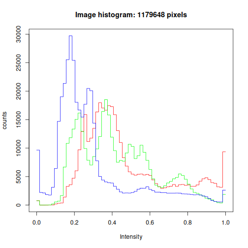

Inspect its dimensions and colorMode.


``` r
colour_img
```

``` output
Image 
  colorMode    : Color 
  storage.mode : double 
  dim          : 768 512 3 
  frames.total : 3 
  frames.render: 1 

imageData(object)[1:5,1:6,1]
          [,1]      [,2]      [,3]      [,4]      [,5]      [,6]
[1,] 0.4549020 0.4784314 0.4941176 0.5137255 0.5294118 0.5529412
[2,] 0.4588235 0.4784314 0.4941176 0.4980392 0.5215686 0.5490196
[3,] 0.4705882 0.4823529 0.4980392 0.5137255 0.5294118 0.5372549
[4,] 0.4666667 0.4745098 0.5058824 0.5137255 0.5450980 0.5647059
[5,] 0.4705882 0.4705882 0.4901961 0.5137255 0.5372549 0.5647059
```

``` r
# or `colormode(colour_img)` or `str(colour_img)`
```

The third dimension corresponds to the red, green, and blue channels.

## Exploring the RGB Channels

Extract the individual colour channels. EBImage's `channel()` function. 


``` r
red_channel <- channel(colour_img, "red")

green_channel <- channel(colour_img, "green")

blue_channel <- channel(colour_img, "blue")
```

Display the channels separately.


``` r
display(
  EBImage::combine(
    red_channel,
    green_channel,
    blue_channel
  ),
  all = TRUE
)
```

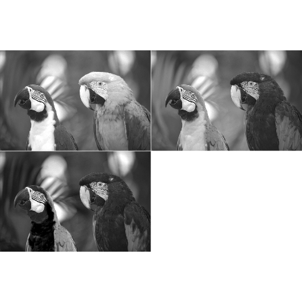

Notice that each channel is itself a grayscale image.

The brightness of a pixel indicates the contribution of that colour channel at
that location.

We can turn each image back into a color image and display those as well:


``` r
red_col_channel <- rgbImage(
  red = red_channel
)

green_col_channel <- rgbImage(
  green = green_channel
)

blue_col_channel <- rgbImage(
  blue = blue_channel
)

display(
  EBImage::combine(
    red_col_channel,
    green_col_channel,
    blue_col_channel
  ),
  all = TRUE
)
```

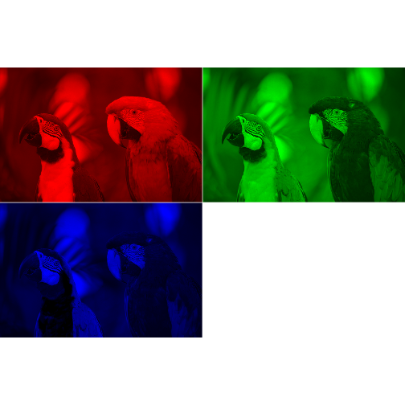

::::::::::::::::::::::::::::::::::::: challenge

A bright pixel in the red channel indicates:

1. Strong red contribution
2. Strong green contribution
3. Strong blue contribution

:::::::::::::::::::::::: solution

```text
1. Strong red contribution
```

The red channel records how much red contributes to each pixel in the final
image.

:::::::::::::::::::::::::::::::::

::::::::::::::::::::::::::::::::::::::::::::::::

## Fluorescence Microscopy Is Different

Fluorescence microscopy images are often displayed in colour.

However, the colours usually do **not** represent the colours detected by the
microscope.

Instead, fluorescence channels typically represent independent biological
measurements. The camera (or detector) makes one measurement for each fluorescence probe.
We can make multiple measurements in the same location because we can label cellular components 
independently with fluorophores that emit photons at different wavelengths. 
Subsequently, the individual channels are combined.

For example, a sample containing DNA stained with DAPI, expressing two fluorescent 
fusion proteins, GFP-Actin and mCherry-Tubulin, may be collected as three separate channels:

```text
DAPI
GFP
mCherry
```

Conceptually:

```text
Pixel
|
├── DAPI Intensity
├── GFP Intensity
└── mCherry Intensity
```

These measurements are not inherently blue, green, or red. The dectors do not see 
the wavelengths of the different channel images. They only count the number of 
photons arriving during the measurement interval during each measurement. 
They are simply numerical measurements acquired from different detectors, 
or from the same detector at different times. Because the same detector is used 
during the separate measurements, each pixel represents the same spatial location for 
each of the three measurements. 

::::::::::::::::::::::::::::::::::::: callout

## Channels Are Measurements

In fluorescence microscopy, channels represent measurements from different
fluorophores or detectors. We assume that if a pixel contains a higher value, there 
were more fluorophores at that location when the image was made. 

The colours shown on screen are usually assigned after the fact, for visualisation.

::::::::::::::::::::::::::::::::::::::::::::::::

## Pseudocolouring

Assigning colours to grayscale microscopy images is known as
**pseudocolouring**.

Suppose we display the same image using several different colours.

```text
Green
Magenta
Yellow
Blue
```

The displayed images look different, but the underlying data are unchanged.

Pseudocolouring helps researchers visualise and distinguish different channels.

## Colours Do Not Change the Data

Consider a DAPI image.


It might be displayed as:


``` r
#Remember, img represents the DAPI image of nuclei acquired from a microscope.

blue_nuc <- rgbImage(
  blue = img
)

display(blue_nuc)
```

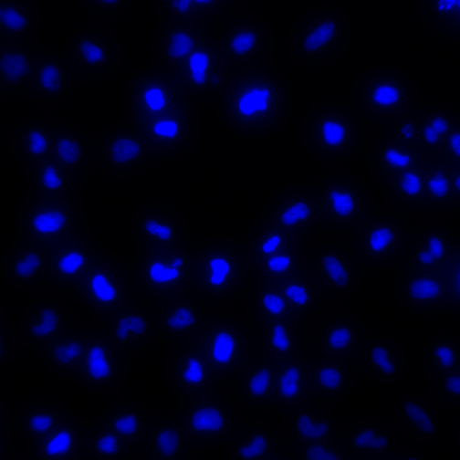

This matches our expectations because we know that DAPI emits in the "blue" range 
of the visible spectrum, therefore we expect that images of DAPI fluorescence should be blue.
--- **BUT** They don't have to be.

The same image could equally be displayed as:


``` r
mag_nuc <- rgbImage(
  red = img/2,
  blue = img/2
)

yel_nuc <- rgbImage(
  red = img/2,
  green = img/2,
)

green_nuc <- rgbImage(
  green = img
)

cyan_nuc <- rgbImage(
  green = img/2,
  blue = img/2
)

display(EBImage::combine(rgb_img, blue_nuc, mag_nuc, yel_nuc, green_nuc, cyan_nuc), all = TRUE)
```

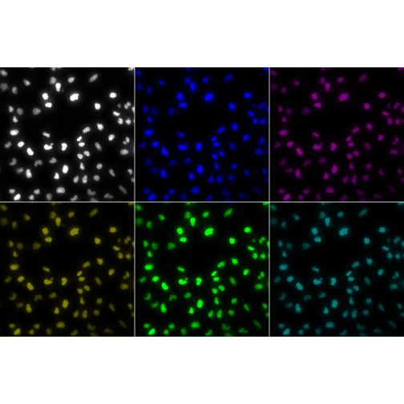

without altering the pixel values. We can even use color rather than hue 
to represent intensity. EBImage has a function - `colormap()` that maps a grayscale 
image using a colormap.


``` r
color_img <- colormap(img, palette = viridis::magma(256))
display(color_img)
```

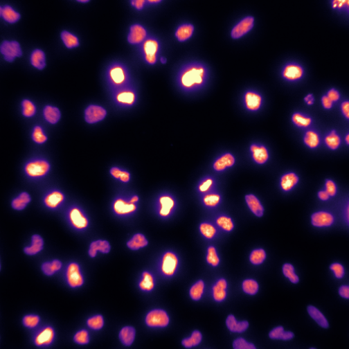


## Creating Composite Images

Multiple fluorescence channels are often displayed together.

Imagine a sample containing:

```text
Nuclei      (DAPI)
Protein A   (GFP)
Protein B   (mCherry)
```

Each channel is acquired independently.

The channels can then be combined into a single colour composite.

Conceptually:

```text
DAPI     → Blue
GFP      → Green
mCherry  → Red
```

↓

```text
Composite Image
```


``` r
#Load the cell body images that correspond to the nuclei images
cel <- readImage(system.file('images', 'cells.tif', package='EBImage'))

#Select the first frame only for our demo. This is the same field of view as img[,,1]
cel <- cel[,,1]

cells_green <- rgbImage(green = cel, blue=img)
cells_red   <- rgbImage(red = cel, blue = img/2, green = img/2)

colour_cells <- EBImage::combine(cells_green, cells_red)

display(colour_cells, all = TRUE)
```

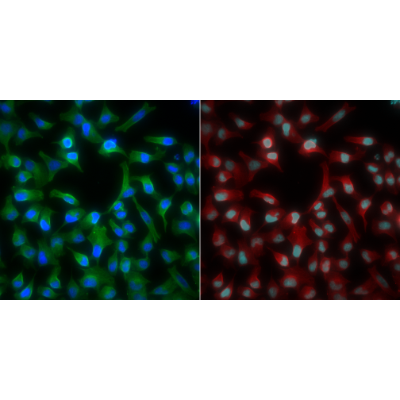

The resulting image helps visualise the spatial relationships between the
different biological structures.


::::::::::::::::::::::::::::::::::::: challenge

Why must we create an RGB image before displaying multiple fluorescence channels?

:::::::::::::::::::::::: solution

A grayscale image stores only one intensity value per pixel.

To display different colours, separate red, green, and blue channels are
required.

An RGB image provides the additional colour information needed for coloured
visualisations.

:::::::::::::::::::::::::::::::::

::::::::::::::::::::::::::::::::::::::::::::::::

## Channels and Quantitative Analysis

When analysing microscopy data, it is important to distinguish between:

`Display Colour` and `Measurement Channel`

For example:

`Blue display colour` does not necessarily mean: `Blue fluorescence`

conversely:

`Green display colour` does not necessarily mean: `Green emission wavelength`

The display colours are visualisation choices.

The channel measurements are the scientific data.

::::::::::::::::::::::::::::::::::::: callout

## Think in Channels, Not Colours

During image analysis it is usually more useful to think in terms of channels
rather than colours.

Segmentation and measurement are performed using image intensities, not display
colours.

::::::::::::::::::::::::::::::::::::::::::::::::

## Looking Ahead

In this lesson we explored how microscopy images are represented and displayed
using colour.

We learned that channels represent measurements, while colours are often chosen
for visualisation.

In the next lesson we will begin modifying image data directly through image
enhancement operations such as inversion, intensity scaling, and thresholding.

## Key Points

::::::::::::::::::::::::::::::::::::: keypoints

- Grayscale images store one intensity value per pixel.
- RGB images store separate red, green, and blue values for each pixel.
- EBImage uses colour modes to distinguish grayscale and colour images.
- Fluorescence microscopy channels are measurements, not colours.
- Pseudocolouring changes appearance but not image data.
- Composite images are created by combining multiple channels.
- Display colours should not be confused with the underlying fluorescence measurements.
- Quantitative image analysis is performed on channel intensities rather than display colours.

::::::::::::::::::::::::::::::::::::::::::::::::
