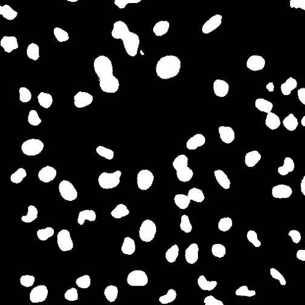
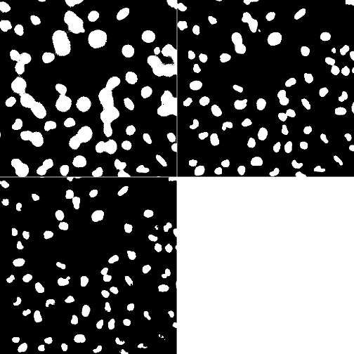
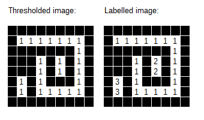
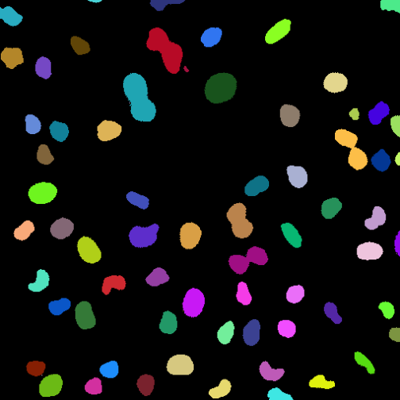
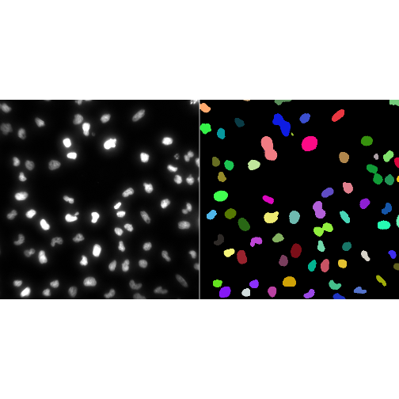
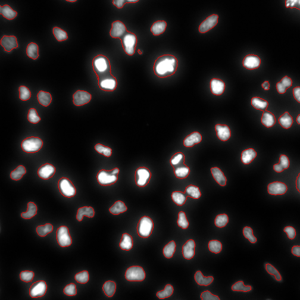

:::::::::::::::::::::::::::::::::::::: questions

- What is image segmentation?
- How can objects be separated from the background?
- What is a binary mask?
- How can individual objects be identified?
- How can segmentation results be visualised and assessed?

::::::::::::::::::::::::::::::::::::::::::::::::

::::::::::::::::::::::::::::::::::::: objectives

- Define image segmentation.
- Create binary masks using thresholding.
- Label connected objects.
- Count segmented objects.
- Visualise segmentation results.
- Recognise common segmentation challenges.

::::::::::::::::::::::::::::::::::::::::::::::::

## Introduction

In the previous lesson we used thresholding to create binary images.

Binary image have only two values. Thresholding allows us to separate pixels into two classes:

```text
Foreground (These pixels are those you care about - objects)
```

and

```text
Background (These are the pixels you don't care about)
```

However, biological image analysis often requires more than simply identifying
foreground pixels.

For example, we may wish to:

- count nuclei
- measure cell or nuclear size
- quantify fluorescence intensity
- compare object shapes

To perform these measurements, we must first identify individual objects.

This process is known as **image segmentation**.

## What Is Segmentation?

Segmentation is the process of dividing an image into meaningful regions.

In bioimage analysis these regions often correspond to biological structures
such as:

- nuclei
- cells
- tissues
- organelles

Conceptually:

```text
Image -> Segmentation -> Objects + Background
```

The goal is to identify the set of pixels belonging to each biological object.

::::::::::::::::::::::::::::::::::::: callout

## Segmentation Is Often the Most Important Step

Many downstream measurements depend on segmentation quality.

Poor segmentation can lead to inaccurate biological conclusions.

::::::::::::::::::::::::::::::::::::::::::::::::

## Reading an Image

Load EBImage.


``` r
library(EBImage)
```

Read an image.


``` r
img <- readImage(
  system.file("images", "nuclei.tif", package = "EBImage"))
  #Select a single frame for demonstration purposes.
  img <- img[,,1]
```

If you want, display the image with `display(img)`. By now, you probably know 
what this image looks like. 

## Creating a Binary Mask

A common segmentation workflow begins with thresholding.

Create a binary mask.


``` r
mask <- img > 0.2
```

Display the result.


``` r
display(mask)
```



The resulting image contains only two pixel values (0/1) often termed classes:

```text
Foreground (things you care about, your 'objects')
Background (things you don't care about)
```

or equivalently:

```text
TRUE  /   1
FALSE /   0
```

::::::::::::::::::::::::::::::::::::: challenge

Which pixels become foreground after thresholding?

:::::::::::::::::::::::: solution

Pixels with intensities greater than the threshold value become foreground
pixels. In some software (e.g. Fiji) you can specify which set of pixels becomes
the background and which becomes the foreground.

:::::::::::::::::::::::::::::::::

::::::::::::::::::::::::::::::::::::::::::::::::

## Segmentation Depends on Threshold Choice

Different threshold values can produce very different segmentation results.

Create several masks.


``` r
mask_1 <- img > 0.1

mask_2 <- img > 0.2

mask_3 <- img > 0.3
```

Display them.


``` r
display(
  EBImage::combine(
    mask_1,
    mask_2,
    mask_3
  ),
  all = TRUE
)
```



Notice how increasing the threshold changes the detected objects.

::::::::::::::::::::::::::::::::::::: challenge

Which threshold is likely to produce the largest foreground regions?

```text
0.1
0.2
0.3
```

:::::::::::::::::::::::: solution

```text
0.1
```

Lower thresholds classify more pixels as foreground. Not necessarily more objects though, 
as each object must be separated from others by background pixels. Exploring thresholds is
often part of an initial classification strategy.

:::::::::::::::::::::::::::::::::

::::::::::::::::::::::::::::::::::::::::::::::::

:::::::::::::::::::::::::::::::::::::::spoiler

## Adaptive thresholding

We've been applying thresholds globally, asking whether a single value
will separate pixels into foreground and background for the whole image. 
EBImage also supplies a function to apply *adaptive thresholding*. 
Adaptive thresholding converts a grayscale image into a binary image by 
comparing each pixel's intensity to the local mean calculated inside a moving rectangular window, 
adjusting automatically for uneven background illumination. In EBImage, 
the `thresh()` function applies adaptive thresholding. As an example:

```r
  mask <- thresh(img, w=3, h=3, offset= 0.03)
```

Where:

`img` is the object to segment.

`w` and `h` are the half-width and half-height of the moving rectangular filter window. 
  The total window size covers width 2w+1 and height 2h+1.

`offset` is a numeric value subtracted or added as a tolerance from the local average intensity.

:::::::::::::::::::::::::::::::::::::::


## A Binary Mask Is Not Yet Segmentation

Although the binary mask separates foreground from background, it does not yet
identify individual objects.

Consider: `Object A`  &  `Object B`

Both may simply appear as foreground pixels.

To measure them separately, we must identify each object individually.

## Connected Components Analysis

Connected-component labelling identifies sets of connected foreground
pixels as unique objects. You can imagine that a labeller starts at a pixel with a value of 0 --- 
remember, at this point, there are only 0s and 1s. It then traverses the entire matrix. 
Every time it encounters a pixel with a value of 1, it assigns it to the next value in turn. 
I.e. the first object gets that value 1, the second object gets the value 2 and so on, until 
every pixel has been visited and all pixels that used to have a value of 1 now have different values. 
All the pixels that had a value of 0 remain 0, but every pixel that was 1 is now assigned to a unique 
number depending on the position of the object in relation to the starting point of the labeller. 
Every pixel that has value 1 is first checked to see whether it is connected to another pixel 
of value > 0 before it is assigned a new unique value. 
Pixel values are changed so that every pixel in a single object gets the 
same pixel intensity value.

{alt="pixels in a thresholded image assigned to objects using CCA"}

Conceptually:

```text
Binary Mask Image
      ↓
Connected Components Analysis
      ↓
Object Label Image
```

Each object receives a unique identifier. Note that the analysis has produced a 
new image with pixel values. We can visualise this image.

## Labelling Objects

Label the objects in the mask. The `bwlabel()` function from EBImage 
labels connected sets of pixels in a binary mask image. 
It assigns a unique increasing integer starting from 1 to each separate foreground object, 
treating pixels with a value of 0 as the background, leaving them unaltered. 
The `bwlabel` image outputs a label image. We can visualise this label image with the 
`colorLabels()` function. . `colorLabels()` takes a label matrix (i.e. a label image, 
typically from `bwlabel()`) and returns a color-coded image where adjacent objects are visually distinct.


``` r
labels <- bwlabel(mask)
```

Inspect the result.


``` r
display(colorLabels(labels))
```



Each colour represents a different object.
We can also use R's pipe operator (`|>`) to make this a bit easier to read.

```r
labels |>
  colorLabels() |>
    display()
```


::::::::::::::::::::::::::::::::::::: callout

## Colours Represent Labels

The colours in a labelled image do not represent intensity values.

They simply help us distinguish neighbouring objects.

::::::::::::::::::::::::::::::::::::::::::::::::

## Counting Objects

How many objects were detected?

Inspect the labels.


``` r
max(labels)
```

``` output
[1] 74
```

The largest label number corresponds to the total number of detected objects in the image.

::::::::::::::::::::::::::::::::::::: challenge

What happens if there are more than 256 objects in an image?

:::::::::::::::::::::::: solution

Nothing special or limiting happens because EBImage label matrices store object 
IDs as full 32-bit signed integers, allowing up to 2<sup>31</sup>-1 objects. However, 
if you try to visualize the label map directly using `display()`, 
values above 1 are clipped as pure white, requiring normalization (`x / max(x)`) 
or `colorLabels()` to inspect properly.

:::::::::::::::::::::::::::::::::

::::::::::::::::::::::::::::::::::::::::::::::::

## Visualising Segmentation Results

Labelling allows us to visualise individual objects.

Visualising the labelled objects, as above, is helpful, 
but segmentation results are often easier to assess when displayed alongside the
original image.


``` r
display(
  EBImage::combine(
    toRGB(img),
    colorLabels(labels)
  ),
  all = TRUE
)
```



Comparing the original image and segmentation result allows us to identify
errors and missed objects.

## Overlaying Labels on the Original Image

An alternative approach is to overlay the segmentation result on the original
image. The `paintObjects()` function in EBImage highlights and marks segmented objects in an image. 
It outlines object boundaries and/or fills their interiors using specified colors and opacities, 
working closely with labeled masks from functions like `bwlabel()`.


``` r
overlay <- paintObjects(
  labels,
  toRGB(img)
)

display(overlay)
```



This allows the image data and segmentation result to be viewed together.

::::::::::::::::::::::::::::::::::::: challenge

Why is it useful to inspect segmentation overlays?

:::::::::::::::::::::::: solution

Overlays allow us to compare the segmentation directly with the original image.

This can reveal:

- missed objects
- merged objects
- incorrectly segmented regions

:::::::::::::::::::::::::::::::::

::::::::::::::::::::::::::::::::::::::::::::::::


## Common Segmentation Challenges

Segmentation is rarely perfect.

Common problems include:

- Missing Objects, if the threshold is too high.
  - Real Objects are excluded.
- Noise, if the threshold is too low.
  -Background pixels are classified as objects.
- Merged Objects. Multiple closely spaced objects merge into one object.
  - Under represent the # of objects with the wrong shape.
- Fragmented objects. Single objects are fragmented into several objects.
  - Over represent the # of objects with the wrong shape.


::::::::::::::::::::::::::::::::::::: callout

## There Is No Universal Threshold

Segmentation methods often need to be adapted to the image and biological
question being studied.Exploratory analysis is used to determine a threshold.

::::::::::::::::::::::::::::::::::::::::::::::::

## Segmentation Supports Measurement

Once objects have been identified, we can begin to measure them.

For example:

- area
- shape
- perimeter
- intensity

Segmentation creates the link between image pixels and biological objects.

Without segmentation, object-based measurements are usually impossible.

::::::::::::::::::::::::::::::::::::: challenge

Why must segmentation usually be performed before measuring nuclear area?

:::::::::::::::::::::::: solution

Area measurements require the pixels belonging to each nucleus to be identified.

Segmentation determines which pixels belong to each object.

:::::::::::::::::::::::::::::::::

::::::::::::::::::::::::::::::::::::::::::::::::

## Looking Ahead

In this lesson we transformed image pixels into labelled objects.
As we learned, a single threshold is often only the first step of creating a biologically 
meaningful segmentation. 
In the next lesson we will explore tools refine these masks, to make them more relevant. 
Only after we have a reasonable segmentation and labelling strategy, does it make sense 
to make measurements and extract quantitative information from biological images.

## Key Points

::::::::::::::::::::::::::::::::::::: keypoints

- Segmentation divides images into meaningful regions.
- Thresholding can be used to create binary masks.
- Binary masks separate foreground from background.
- Connected-component labelling identifies individual objects.
- Each segmented object receives a unique label.
- Segmentation results should always be inspected visually.
- Segmentation quality influences all downstream measurements.
- Segmentation provides the foundation for quantitative image analysis.

::::::::::::::::::::::::::::::::::::::::::::::::
