:::::::::::::::::::::::::::::::::::::: questions

- How can segmentation results be improved?
- What is pixel connectivity?
- What are morphological operations?
- How can small artefacts be removed from binary images?
- How can touching objects be separated?

::::::::::::::::::::::::::::::::::::::::::::::::

::::::::::::::::::::::::::::::::::::: objectives

- Explain the concept of connectivity.
- Apply morphological operations to binary images.
- Remove small artefacts from segmentation masks.
- Fill holes within segmented objects.
- Understand the purpose of distance maps.
- Use watershed segmentation to separate touching objects.

::::::::::::::::::::::::::::::::::::::::::::::::

## Introduction

In the previous lesson we used thresholding to create binary masks and
identified individual objects using connected-component labelling.

However, segmentation is rarely perfect.

Real microscopy images often contain:

- noise
- small artefacts
- holes within objects
- touching nuclei
- fragmented objects

Before making biological measurements, it is often necessary to refine a
segmentation.

In this lesson we will explore a set of tools known as **morphological
operations** that help improve binary masks and prepare them for quantitative
analysis. In contrast to point operations, morphological operations depend not only 
on the value of the pixel in question, but the values of the neighbourhood of 
pixels that surround the pixel.

## Reading an Image

Load the EBImage package.


``` r
library(EBImage)
```

Load the example nuclei image provided with EBImage and select a single frame for exploration.


``` r
img <- readImage(
  system.file(
    "images",
    "nuclei.tif",
    package = "EBImage"
  )
)

nuclei <- img[,,1]
```

Display the image.


``` r
display(nuclei)
```


``` r
mask <- nuclei > 0.175
```

Create a binary mask.


``` r
mask <- nuclei > 0.175
```

Display the mask.


``` r
display(mask)
```

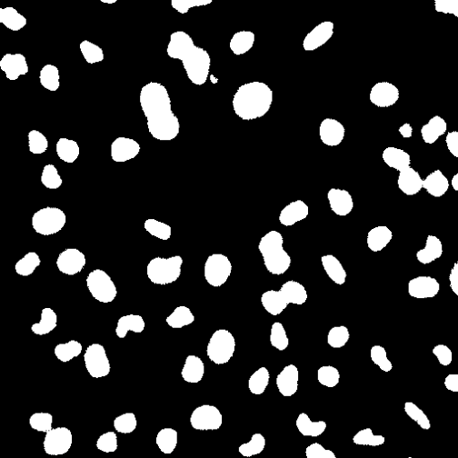

Although the nuclei are obvious to a trained biologist, the segmentation is not perfect.

::::::::::::::::::::::::::::::::::::: challenge

Why might a simple threshold not be sufficient for accurate segmentation?

:::::::::::::::::::::::: solution

Thresholding separates foreground from background but does not account for:

- image noise
- holes inside objects
- touching objects
- irregular boundaries

Additional processing is often required before labelling and measurement.

:::::::::::::::::::::::::::::::::

::::::::::::::::::::::::::::::::::::::::::::::::

## Connectivity

Before discussing morphological operations, we need to understand the concept
of connectivity.

Connectivity defines which neighbouring pixels are considered connected.

Connectivity comes in two flavours:

### Four-Connectivity

A pixel is connected only to its horizontal and vertical neighbours.

```text
    X
    |
X - P - X
    |
    X
```

### Eight-Connectivity

A pixel is connected to all surrounding neighbours.

```text
X  X  X
X  P  X
X  X  X
```

In biological images, connectivity influences how objects are identified and
labelled.

::::::::::::::::::::::::::::::::::::: callout

## Connectivity Influences Segmentation

Two adjacent pixels may belong to the same object or separate objects depending
on the connectivity rule used.

::::::::::::::::::::::::::::::::::::::::::::::::

## Morphological Operations

Morphological operations modify the shape of objects in binary images.

They operate on image structures rather than intensity values. We start 
with a mask, modify it using some rule, and output a modified mask image. 

Conceptually:

```text
Binary Mask -> Morphological Operation -> Modified Mask
```

These operations can be used to:

- remove noise
- smooth boundaries
- fill gaps
- separate objects

## Structuring Elements

Many morphological operations use a small template called a
**structuring element**.

Create a circular structuring element.


``` r
brush <- makeBrush(
  size = 5,
  shape = "disc"
)
```

Display the brush.


``` r
display(brush)
```


The structuring element determines how neighbouring pixels influence the
operation. The structuring element defines the size and shape of the neighbourhood 
used in the operation. Larger brushes produce larger changes to object boundaries, 
while smaller brushes produce more subtle effects. using a brush with a size = 3
is roughly equivalent to dilating or eroding by one pixel. In EBImage,
the two basic morphological operations are `erosion()` and `dilation()`. 
Each function takes two arguments,a binary image to refine and the structuring element (aka `brush`). 
The `brush` determines the size of the change that the function creates.

## Dilation

Dilation expands foreground objects. It adds pixels to the boundaries/perimeters of objects.


``` r
dilated <- dilate(mask, brush)
```

Display the original and dilated masks to see how `dilation()` has changed the 
original mask.


``` r
display(
  EBImage::combine(
    toRGB(mask),
    toRGB(dilated)
  ),
  all = TRUE
)
```

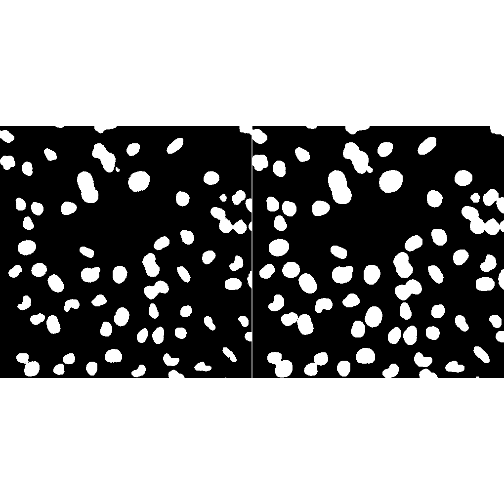

Notice that objects become larger.

Small gaps may also be filled.

::::::::::::::::::::::::::::::::::::: challenge

Would dilation tend to increase or decrease object size?

:::::::::::::::::::::::: solution

Increase.

Dilation adds pixels to object boundaries, making objects larger.

:::::::::::::::::::::::::::::::::

::::::::::::::::::::::::::::::::::::::::::::::::

## Erosion

Erosion does the opposite of dilation. Erosion removes pixels from object boundaries.


``` r
eroded <- erode(mask, brush)
```

Display the result.


``` r
display(
  EBImage::combine(
    toRGB(mask),
    toRGB(eroded)
  ),
  all = TRUE
)
```

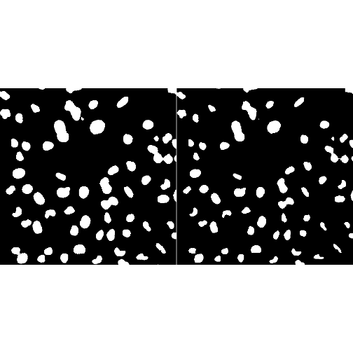

Objects become smaller.

Thin structures may disappear entirely.

::::::::::::::::::::::::::::::::::::: challenge

What effect might erosion have on very small objects?

:::::::::::::::::::::::: solution

Very small objects may be reduced substantially or disappear completely.

:::::::::::::::::::::::::::::::::

::::::::::::::::::::::::::::::::::::::::::::::::


## Opening & Closing

Usually, you don't want to significantly change an object's size. 
`Opening` and `closing` are used instead of basic `erosion` and `dilation` 
to maintain object size. 
`Opening` removes small dots and breaks thin lines. 
`Closing` fills small holes and joins broken parts. In contrast, 
`erosion` and `dilation` change the size of objects.

Opening is defined as one erosion operation followed by one dilation operation.


``` r
opened <- opening(mask, brush)
```

Display the comparison.


``` r
display(
  EBImage::combine(
    toRGB(mask),
    toRGB(opened)
  ),
  all = TRUE
)
```

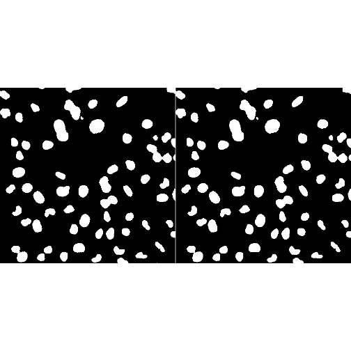

Opening is often used to remove small objects and single pixel noise.

### What Opening Does

```text
Small Artefacts -> Removed
```

while larger objects are largely preserved.


Closing is the opposite of Opening. It is defined as one dilation followed by one erosion.


``` r
closed <- closing(mask, brush)
```

Display the result.


``` r
display(
  EBImage::combine(
    toRGB(mask),
    toRGB(closed)
  ),
  all = TRUE
)
```

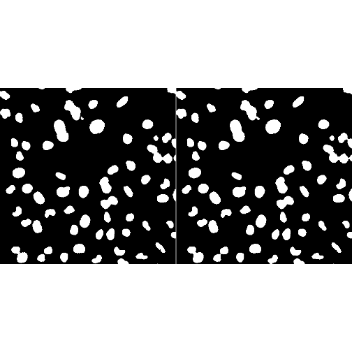

Closing helps to:

- fill small gaps
- smooth object boundaries
- connect nearby object regions

### What Closing Does

```text
Small Gaps -> Filled
```

::::::::::::::::::::::::::::::::::::: challenge

Which operation would generally be most useful for removing small isolated
noise particles?

1. Opening
2. Closing

:::::::::::::::::::::::: solution

```text
1. Opening
```

Opening is commonly used to remove small foreground artefacts. If the artefacts
are small holes in the objects, then Closing would be useful.

:::::::::::::::::::::::::::::::::

::::::::::::::::::::::::::::::::::::::::::::::::

See this figure of a noisy thresholded image of a fingerprint.

{alt="fingerprint binary image corupted with noise." width="32%"}
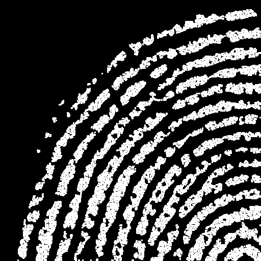{alt=" binary image, noise removed with opening." width="32%"}
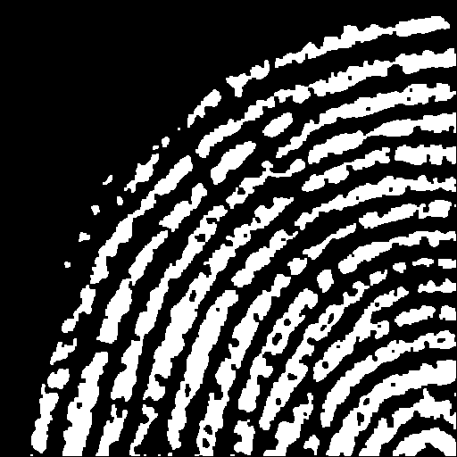{alt="binary image, noise removed with closing." width="32%"}
Fingreprint Corrupted With Noise.       Fingreprint Opened            Fingerprint Opened & Closed

## Filling Holes

Objects may sometimes contain holes.

For example:

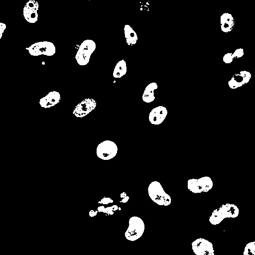{alt="binary image with holes." width=512}

where the centre of the object is incorrectly classified as background.

The `fillHull()` function can fill holes.

{alt="binary image without holes." width=512}


``` r
filled <- fillHull(mask)
```

Display the result. Note that this particular binary image already has no objects 
with holes. 


``` r
display(
  EBImage::combine(
    toRGB(mask),
    toRGB(filled)
  ),
  all = TRUE
)
```

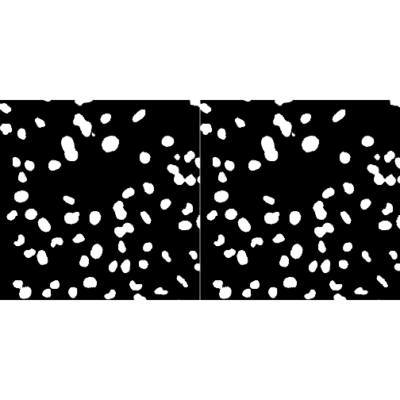

This operation is particularly useful when working with nuclei, as nucleoli are 
often less bright than the neighbouring nucleoplasm and often results in holes in the 
binary images.

::::::::::::::::::::::::::::::::::::: callout

## Filling Holes Simplifies Measurement

Area measurements are often more reliable when segmented objects form solid
regions.

::::::::::::::::::::::::::::::::::::::::::::::::

## The Problem of Touching Objects

Thresholding often merges neighbouring objects into a single object.

There are several examples of this issue in our binary image of nuclei.


This phenomenon is called **under-segmentation**.

## Distance Maps

One approach to separating touching objects involves calculating the distance
from each foreground pixel to the nearest background pixel, followed by the watershed operation. The `distmap()` function
from EBImage calculates a euclidean distance map. Note that again, the input is a binary image and the 
ouput is another image where the pixel values indicate how far each pixel is from 
the nearest background pixel. pixels at the border get a value of 1. 
Each successive pixel distance is assigned an increased value. Because these matrices have pixel values, we can 
visualise them as images. 

Create a distance map.


``` r
dmap <- distmap(mask)
```

Display the distance map.


``` r
display(
  normalize(dmap)
)
```

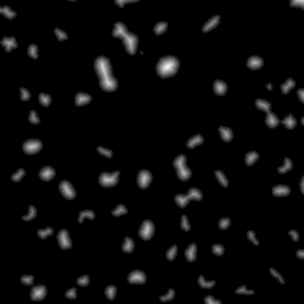

Bright regions correspond to pixels located near object centres.


## How Watershed Segmentation Works

The idea behind watershed segmentation comes from imagining the image as a
landscape.

A distance map contains large values near the centres of objects and smaller
values near object boundaries. To make the watershed concept easier to
visualise, imagine turning this landscape upside down.

After inversion:

```text
Object Centre
      ↓
   Valley

Object Boundary
      ↓
    Ridge
```

For two touching nuclei, the inverted distance map might look something like:

```text
\      __      /
 \    /  \    /
  \  /    \  /
   \/      \/
```

The valleys correspond approximately to the centres of the nuclei, while the
ridge between them corresponds to the region where the objects touch.

Now imagine slowly filling the valleys with water.

As the water level rises, each valley fills independently and expands
outwards. Eventually, water originating from neighbouring valleys meets at the
ridge between them.

If the water were allowed to mix, the two objects would merge. Instead, the
watershed algorithm constructs a barrier wherever two expanding regions meet.

These barriers become the segmentation boundaries.

Conceptually:

```text
Binary Mask
      ↓
Distance Map
      ↓
Invert Landscape
      ↓
Fill Valleys With Water
      ↓
Build Barriers Where Waters Meet
      ↓
Separate Objects
```

The result is that a single connected object in the binary mask can be divided
into multiple biologically meaningful objects.

In microscopy, the watershed segmentation is particularly useful for separating
touching nuclei. Nuclear identification is often the first step in identifying cells.
Thresholding may identify a cluster of adjacent nuclei as one
large object, but the watershed algorithm can often recover the individual
nuclei by placing boundaries between their centres.

A useful way to think about watershed segmentation is:

> "If water were poured into each object centre, where would neighbouring
> pools of water meet?"

The watershed boundary is constructed at those meeting points. In EBImage, 
the watershed algorithm (`watershed`) operates on a distance map.


``` r
ws <- watershed(dmap)
```

Display the result.


``` r
display(
  colorLabels(ws)
)
```

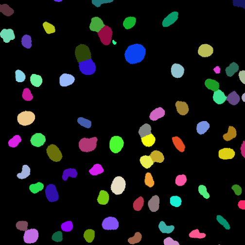

Each object receives a unique label. Notice that the `ws()` function also inlcudes 
the connected components analysis -- in EBImage.

Watershed segmentation often separates objects that were previously merged.

## Visualising Watershed Results

Compare the watershed segmentation to the original image and the segmentation 
without the watershed algorithm.


``` r
labels <- bwlabel(mask)

overlay_ws <- paintObjects(
  ws,
  toRGB(normalize(nuclei))
)
overlay_label <- paintObjects(
  labels,
  toRGB(normalize(nuclei))
)

display(EBImage::combine(overlay_ws, overlay_label), all = TRUE)
```

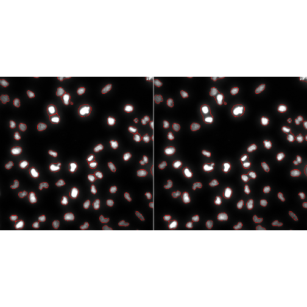

Overlay visualisation makes it easier to evaluate segmentation quality.

::::::::::::::::::::::::::::::::::::: challenge

Why might watershed segmentation be useful for nuclei images?

:::::::::::::::::::::::: solution

Nuclei often touch or overlap.

Thresholding may merge adjacent nuclei into a single object.

Watershed segmentation can help separate these merged regions into individual
objects.

:::::::::::::::::::::::::::::::::

::::::::::::::::::::::::::::::::::::::::::::::::

## Segmentation Is an Iterative Process

Image analysis rarely consists of a single thresholding step.

A typical workflow might be:

```text
Image
  ↓
Explore Different Thresholds
  ↓
Iteratively Apply Morphological Operations
  ↓
Distance Map
  ↓
Watershed Segmentation
  ↓
Labelled Objects
```

Each stage improves the quality of the final segmentation. 
Note that in some watershed implementations (e.g. Fiji) the distance map
operation is part of the watershed function. 

::::::::::::::::::::::::::::::::::::: callout

## There Is No Perfect Segmentation

The best segmentation is one that is appropriate for the biological question
being asked and supports reliable measurements.

::::::::::::::::::::::::::::::::::::::::::::::::

## Looking Ahead

In this lesson we refined segmentation masks using morphological operations and
watershed segmentation.

In the next lesson we will use these labelled objects to make quantitative
measurements such as:

- object count
- area
- shape
- fluorescence intensity

## Key Points

::::::::::::::::::::::::::::::::::::: keypoints

- Connectivity defines how neighbouring pixels are linked into objects.
- Morphological operations modify object shape in binary images.
- Dilation expands objects.
- Erosion shrinks objects.
- Opening removes small foreground artefacts.
- Closing fills small gaps and smooths boundaries.
- Filling holes can improve segmented objects.
- Distance maps identify object centres.
- Watershed segmentation can separate touching objects.
- Segmentation quality strongly influences downstream measurements.

::::::::::::::::::::::::::::::::::::::::::::::::
