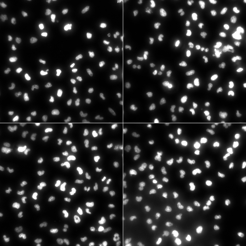
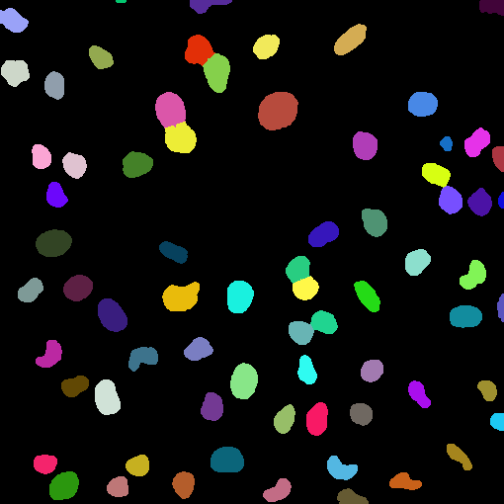
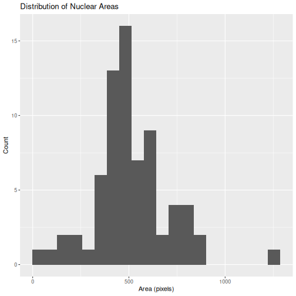
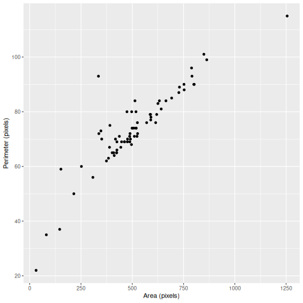
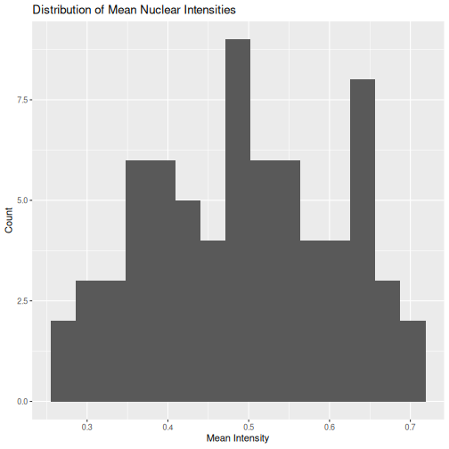
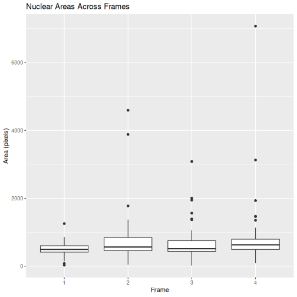

:::::::::::::::::::::::::::::::::::::: questions

- How can segmented objects be measured?
- What properties can be measured from biological objects?
- How can fluorescence intensity be quantified?
- How can image measurements be organised as tidy data?
- How can a measurement workflow be applied to multiple images?

::::::::::::::::::::::::::::::::::::::::::::::::

::::::::::::::::::::::::::::::::::::: objectives

- Measure properties of segmented biological objects.
- Count segmented nuclei.
- Calculate shape measurements.
- Organise measurements as tidy data.
- Visualise measurements using ggplot2.
- Apply the same measurement workflow to multiple images.
- Export measurements for downstream analysis.

::::::::::::::::::::::::::::::::::::::::::::::::

## Introduction

In the previous lessons we learned how to:

```text
Read Images
     ↓
Enhance Images
     ↓
Segment Objects
     ↓
Refine Segmentations
```

The goal of image analysis is usually not to create better images.

Instead, the goal is to generate quantitative measurements that can be used to
answer biological questions.

In this lesson we will measure properties of segmented nuclei and convert image
data into a table of measurements that can be analysed using the broader R
ecosystem.

::::::::::::::::::::::::::::::::::::: callout

## From Images to Data

Segmentation identifies objects.

Measurement converts those objects into quantitative data.

::::::::::::::::::::::::::::::::::::::::::::::::

## Reading the Image Stack

Load the required packages.


``` r
library(EBImage)
library(ggplot2)
```

Load the nuclei image supplied with EBImage.


``` r
img <- readImage(
  system.file(
    "images",
    "nuclei.tif",
    package = "EBImage"
  )
)
```

Inspect the dimensions.


``` r
dim(img)
```

``` output
[1] 510 510   4
```

The image contains four frames.

Display all four images.


``` r
display(img, all = TRUE)
```



## Starting With One Image

To understand the workflow, we will first analyse a single frame.

Extract the first image.


``` r
nuclei <- img[,,1]
```

Display the image.


``` r
display(nuclei)
```


## Segmenting the Nuclei

Create a binary mask.


``` r
mask <- nuclei > 0.2
```

Display the mask.


``` r
display(mask)
```


Apply a small amount of morphological cleanup.


``` r
mask <- opening(
  mask,
  makeBrush(
    size = 5,
    shape = "disc"
  )
)
```

Create a distance map.


``` r
dmap <- distmap(mask)
```

Separate touching nuclei using watershed segmentation.


``` r
labels <- watershed(dmap)
```

Display the labelled objects.


``` r
display(
  colorLabels(labels)
)
```



Each segmented nucleus has now been assigned a unique label.

## Counting Objects

The simplest measurement is object count.


``` r
max(labels)
```

``` output
[1] 71
```

Each label corresponds to a segmented object.


## Measuring Object Shape

EBImage can calculate a variety of shape measurements.


``` r
shape_features <- computeFeatures.shape(
  labels
)
```

Inspect the first few measurements.


``` r
head(shape_features)
```

``` output
  s.area s.perimeter s.radius.mean s.radius.sd s.radius.min s.radius.max
1   1255         115      19.56079    1.354706    16.851564     22.20696
2    863          99      16.16382    1.395929    13.934709     18.91353
3    789          96      15.33404    1.303375    10.882979     17.80045
4    337          72      10.20631    2.551165     5.555573     14.10685
5    802          90      15.57667    1.779067    12.738481     18.94208
6    791          93      15.52903    2.644496    10.779113     20.42890
```

Each row represents a nucleus.

Each column represents a measurement.

## Creating Tidy Data

Many R packages work most naturally with data frames.

Creaet a data fram of the measurements.


``` r
shape_df <- as.data.frame(
  computeFeatures.shape(labels)
)
```

Inspect the data.


``` r
head(shape_df)
```

``` output
  s.area s.perimeter s.radius.mean s.radius.sd s.radius.min s.radius.max
1   1255         115      19.56079    1.354706    16.851564     22.20696
2    863          99      16.16382    1.395929    13.934709     18.91353
3    789          96      15.33404    1.303375    10.882979     17.80045
4    337          72      10.20631    2.551165     5.555573     14.10685
5    802          90      15.57667    1.779067    12.738481     18.94208
6    791          93      15.52903    2.644496    10.779113     20.42890
```

Each row represents a single nucleus.

Each column represents a single measurement.

This follows the principles of tidy data:

- each row represents one observation
- each column represents one variable
- each cell contains one value


::::::::::::::::::::::::::::::::::::: callout

## Image Analysis Produces Tidy Data

A common goal of image analysis is to transform image pixels into structured
datasets that can be analysed using standard statistical and visualisation
tools.

::::::::::::::::::::::::::::::::::::::::::::::::

## Measuring Nuclear Area

Area is often one of the most important biological measurements.

Inspect the area measurement.


``` r
head(
  shape_df$s.area
)
```

``` output
[1] 1255  863  789  337  802  791
```

Area is reported in pixels.


## Visualising Nuclear Areas

Create a histogram of nuclear areas.


``` r
ggplot(
  shape_df,
  aes(x = s.area)
) +
  geom_histogram(
    bins = 20
  ) +
  labs(
    title = "Distribution of Nuclear Areas",
    x = "Area (pixels)",
    y = "Count"
  )
```



The histogram summarises the distribution of nucleus sizes within the image.

Notice that we are no longer visualising an image.

Instead, we are visualising measurements extracted from biological objects.

## Exploring Shape Measurements

Nuclei can be described using many measurements.

For example, we can compare object area and perimeter.


``` r
ggplot(
  shape_df,
  aes(
    x = s.area,
    y = s.perimeter
  )
) +
  geom_point() +
  labs(
    x = "Area (pixels)",
    y = "Perimeter (pixels)"
  )
```



Each point represents a single nucleus.


## Measuring Intensity

Object shape is not the only quantity that can be measured.

We can also measure pixel intensities inside each segmented nucleus.

Calculate intensity measurements.


``` r
intensity_features <- as.data.frame(
  computeFeatures.basic(
    labels,
    nuclei
  )
)
```

Inspect the results.


``` r
head(intensity_features)
```

``` output
     b.mean      b.sd     b.mad    b.q001    b.q005     b.q05    b.q095 b.q099
1 0.6448934 0.3280021 0.5523412 0.2039216 0.2156863 0.6274510 1.0000000      1
2 0.5980506 0.3275716 0.3604753 0.2078431 0.2196078 0.4705882 1.0000000      1
3 0.5885136 0.3277748 0.3372188 0.2039216 0.2156863 0.4509804 1.0000000      1
4 0.5512306 0.2463818 0.3081482 0.2039216 0.2196078 0.5411765 0.9968627      1
5 0.6208841 0.2668144 0.3662894 0.2078431 0.2235294 0.6431373 1.0000000      1
6 0.6496963 0.2946438 0.4593153 0.2074510 0.2215686 0.6901961 1.0000000      1
```

## Mean Intensity

One useful measurement is mean intensity.


``` r
head(
  intensity_features$b.mean
)
```

``` output
[1] 0.6448934 0.5980506 0.5885136 0.5512306 0.6208841 0.6496963
```

Mean intensity describes the average signal within a nucleus.

::::::::::::::::::::::::::::::::::::: challenge

Which nucleus has the stronger fluorescence signal?

```text
Nucleus A = 0.21

Nucleus B = 0.38
```

:::::::::::::::::::::::: solution

```text
Nucleus B
```

The larger mean intensity indicates a stronger signal.

:::::::::::::::::::::::::::::::::

::::::::::::::::::::::::::::::::::::::::::::::::

## Combining Measurements

Combine shape and intensity measurements.


``` r
features_df <- cbind(
  shape_df,
  intensity_features
)
```

Inspect the combined table.


``` r
head(features_df)
```

``` output
  s.area s.perimeter s.radius.mean s.radius.sd s.radius.min s.radius.max
1   1255         115      19.56079    1.354706    16.851564     22.20696
2    863          99      16.16382    1.395929    13.934709     18.91353
3    789          96      15.33404    1.303375    10.882979     17.80045
4    337          72      10.20631    2.551165     5.555573     14.10685
5    802          90      15.57667    1.779067    12.738481     18.94208
6    791          93      15.52903    2.644496    10.779113     20.42890
     b.mean      b.sd     b.mad    b.q001    b.q005     b.q05    b.q095 b.q099
1 0.6448934 0.3280021 0.5523412 0.2039216 0.2156863 0.6274510 1.0000000      1
2 0.5980506 0.3275716 0.3604753 0.2078431 0.2196078 0.4705882 1.0000000      1
3 0.5885136 0.3277748 0.3372188 0.2039216 0.2156863 0.4509804 1.0000000      1
4 0.5512306 0.2463818 0.3081482 0.2039216 0.2196078 0.5411765 0.9968627      1
5 0.6208841 0.2668144 0.3662894 0.2078431 0.2235294 0.6431373 1.0000000      1
6 0.6496963 0.2946438 0.4593153 0.2074510 0.2215686 0.6901961 1.0000000      1
```

Each row represents a nucleus.

The columns now contain both:

- shape measurements
- intensity measurements

## Exploring Relationships Between Measurements

Compare area and mean intensity.


``` r
ggplot(
  features_df,
  aes(
    x = s.area,
    y = b.mean
  )
) +
  geom_point() +
  labs(
    x = "Area (pixels)",
    y = "Mean Intensity"
  )
```


Plots such as this can help identify biological relationships between
measurements.

::::::::::::::::::::::::::::::::::::: callout

## Images Become Data

At this stage of the workflow we are no longer analysing images directly.

We are analysing measurements extracted from biological objects.

::::::::::::::::::::::::::::::::::::::::::::::::

## Visualising Nuclear Intensity Measurements

Earlier we measured the mean intensity of each segmented nucleus.

We can visualise those measurements using a histogram.


``` r
ggplot(
  features_df,
  aes(x = b.mean)
) +
  geom_histogram(
    bins = 15
  ) +
  labs(
    title = "Distribution of Mean Nuclear Intensities",
    x = "Mean Intensity",
    y = "Count"
  )
```



The histogram summarises the intensity measurements for every segmented nucleus.

Notice that not all nuclei have the same intensity.

Some nuclei have relatively low mean intensities, while others have
substantially higher values.

This variation is often referred to as **biological heterogeneity**.

::::::::::::::::::::::::::::::::::::: callout

## Biological Variation

Image analysis allows us to quantify differences between individual cells.

Rather than simply observing that cells "look different", we can measure and
visualise those differences quantitatively.

::::::::::::::::::::::::::::::::::::::::::::::::

## From Measurements to Biological Insight

The image analysed in this lesson is not intended for cell-cycle analysis.

However, similar measurements are widely used in biological research.

For example, consider a fluorescence image in which DNA has been stained with a
DNA-binding dye.

Cells in different phases of the cell cycle often contain different amounts of
DNA:

```text
G1 Phase
    ↓
Lower DNA Content

S Phase
    ↓
DNA Replication

G2 Phase
    ↓
Higher DNA Content
```

If fluorescence intensity is proportional to DNA content, a histogram of
nuclear intensities may reveal distinct populations of cells.

Conceptually:

```text
Number of Cells
      ^
      |
      |       /\            /\
      |      /  \          /  \
      |     /    \___ ____/    \
      +---------------------------->

          G1      S       G2

             DNA Content
```

In an experiment designed to measure DNA content, such a distribution could be
used to investigate:

- cell-cycle progression
- responses to drug treatment
- changes in cellular physiology
- differences between biological conditions

The important idea is not the specific biological interpretation.

The important idea is that image analysis transforms images into measurements,
and measurements can generate biological insight.

::::::::::::::::::::::::::::::::::::: challenge

Why is a histogram often more informative than simply looking at the original
image?

:::::::::::::::::::::::: solution

The image allows us to see individual nuclei, but it can be difficult to judge
overall patterns by eye.

A histogram summarises measurements across many objects simultaneously and can
reveal trends, variation, and potentially distinct biological populations.

:::::::::::::::::::::::::::::::::

::::::::::::::::::::::::::::::::::::::::::::::::

## Quantitative Biology

Earlier in the course we focused on images.

Now we are beginning to focus on measurements.

This transition is one of the most powerful aspects of bioimage analysis.

Conceptually:

```text
Image
   ↓
Segmentation
   ↓
Objects
   ↓
Measurements
   ↓
Biological Interpretation
```

The measurements extracted from images can be analysed using many of the same
approaches used for other biological datasets, including:

- summary statistics
- hypothesis testing
- data visualisation
- modelling

Images provide the raw information.

Measurements allow us to answer biological questions.

## Applying the Workflow to Multiple Images

So far we have analysed only one frame.

However, the image stack contains four frames.

One of the advantages of scripted image analysis is that the same workflow can
be applied repeatedly.

Conceptually:

```text
Image 1
Image 2
Image 3
Image 4
      ↓
Same Workflow
      ↓
One Dataset
```

## Creating a Measurement Function

Create a function that performs segmentation and measurement.


``` r
measure_nuclei <- function(image, frame_id) {

  mask <- image > 0.2

  mask <- opening(
    mask,
    makeBrush(
      size = 5,
      shape = "disc"
    )
  )

  labels <- watershed(
    distmap(mask)
  )

  shape_df <- as.data.frame(
    computeFeatures.shape(labels)
  )

  shape_df$frame <- frame_id

  shape_df
}
```

Apply the function to the first image.


``` r
measure_nuclei(
  img[,,1],
  frame_id = 1
)
```

``` output
   s.area s.perimeter s.radius.mean s.radius.sd s.radius.min s.radius.max frame
1    1255         115     19.560786   1.3547061   16.8515637    22.206961     1
2     863          99     16.163824   1.3959290   13.9347086    18.913528     1
3     789          96     15.334041   1.3033746   10.8829792    17.800447     1
4     337          72     10.206313   2.5511655    5.5555729    14.106852     1
5     802          90     15.576672   1.7790672   12.7384806    18.942075     1
6     791          93     15.529028   2.6444965   10.7791127    20.428896     1
7     800          90     15.544858   1.8165139   12.3747902    18.500507     1
8     849         101     16.141025   2.9391444    9.5413135    21.642849     1
9     727          87     14.770758   1.4910352   11.7367354    17.148551     1
10    752          90     15.010374   1.6340218   11.5752023    17.707085     1
11    692          85     14.469850   1.4280601   12.3696246    17.131549     1
12    619          79     13.576061   1.0290429   11.5604623    15.480040     1
13    753          88     15.208822   2.0842205   11.4711111    18.552629     1
14    664          84     14.092004   1.2516541   11.0207043    16.770261     1
15    590          77     13.243149   0.9543572   11.0462619    15.370968     1
16    614          76     13.590623   0.9675961   11.4462492    15.647962     1
17    641          81     13.867851   1.3985121   10.9926331    16.717654     1
18    477          70     11.866848   1.1315345    8.9481272    13.562990     1
19    730          89     14.852200   2.3925918   10.2377371    18.464726     1
20    501          74     12.169812   1.3864165    8.9902654    14.924604     1
21    589          79     13.300932   1.5427899   10.1916423    16.292693     1
22    523          71     12.498655   1.0461734   10.6347355    14.715580     1
23    591          78     13.278661   1.0792004   10.3465431    15.015366     1
24    496          68     12.189577   0.9641451   10.6825558    14.708919     1
25    487          71     12.034091   0.9355042    9.9006972    14.000347     1
26    510          71     12.369147   1.3155411   10.2341754    14.822149     1
27    488          69     12.035258   0.9792426   10.3317173    13.993975     1
28    347          73     10.785559   3.3759440    5.0762066    17.224169     1
29    526          72     12.579250   1.3454081   10.0854471    14.956218     1
30    625          83     13.683353   2.0555514    9.9727747    16.854039     1
31    252          60      8.967579   2.7276929    4.2749919    14.380851     1
32    587          79     13.345331   2.4208449    9.0051259    17.428803     1
33    519          74     12.420212   1.4474638    9.4064344    14.971863     1
34    335          93     12.179152   5.8732791    1.9429367    22.486573     1
35    476          69     11.892219   1.1772365    9.3196520    14.486905     1
36    423          65     11.143364   0.6081222    9.8149144    12.335449     1
37    489          72     12.036776   1.3446067    9.0899674    14.425662     1
38    424          65     11.179478   0.7565775    9.8488938    12.630882     1
39    570          76     13.250634   2.4004386    8.0851168    17.012400     1
40    412          64     11.006611   0.9535172    8.8268943    12.773569     1
41    491          70     12.184170   1.7038003    8.2894204    15.186467     1
42    462          69     11.687901   1.5545730    8.7545949    14.368526     1
43    402          65     10.883830   1.3938151    7.8944666    13.534554     1
44    508          74     12.437431   2.0263185    8.9398301    15.643029     1
45    499          74     12.447163   2.0077931    9.1877781    16.110568     1
46    448          69     11.599073   2.0755634    7.0119920    14.879513     1
47    632          84     14.597432   3.7059594    8.5782050    20.241750     1
48    518          74     12.575742   2.2987069    7.6272382    15.757852     1
49    462          69     11.867353   2.0794449    8.6066093    15.994151     1
50    384          63     10.601006   1.0331500    8.5687974    12.642038     1
51    374          62     10.454879   0.8183839    8.9032404    11.977531     1
52    425          66     11.352217   1.7303238    8.1359545    14.379482     1
53    409          65     11.021827   1.6443670    7.3683314    13.700084     1
54    444          67     11.683740   1.9736260    7.8956494    14.462956     1
55    525          76     13.195475   3.3152333    8.0659612    18.258574     1
56    518          80     12.414659   2.8811872    5.1429563    16.144659     1
57    215          50      7.884001   1.2027203    5.1803475    10.332280     1
58    418          70     11.272386   2.4789015    6.7951513    15.540815     1
59    513          84     12.279138   3.2052316    4.1313812    16.664668     1
60    474          80     11.954409   3.0525464    4.1831881    16.370677     1
61    389          67     11.036187   3.0354451    5.3702314    15.838381     1
62    308          56      9.549327   1.4124404    6.3085270    11.738719     1
63    437          71     11.524620   2.8400509    4.9863531    15.756655     1
64    497          80     12.237759   3.2723619    3.7001900    16.203901     1
65    391          75     11.062234   3.3103694    5.4517683    16.586393     1
66    425          69     11.476506   2.8507576    6.5940755    16.019574     1
67    152          59      7.971661   3.5604339    2.1423085    14.329524     1
68    351          70     11.158838   3.9730132    4.0367698    17.175017     1
69     81          35      5.070547   1.9167780    1.8711559     8.435542     1
70    146          37      6.417406   0.7481823    5.0897712     7.543591     1
71     31          22      2.996750   1.3857546    0.9090909     5.081973     1
```

## Measuring Every Frame

The image stack contains four images.

Rather than analysing each image manually, we can repeat the same workflow for
every frame.

Create an empty data frame to store the results.


``` r
all_measurements <- data.frame()
```

Loop through each frame in the image stack.


``` r
for (i in seq_len(numberOfFrames(img))) {

  frame_measurements <- measure_nuclei(
    img[,,i],
    frame_id = i
  )

  all_measurements <- rbind(
    all_measurements,
    frame_measurements
  )

}
```

Inspect the first few rows.


``` r
head(all_measurements)
```

``` output
  s.area s.perimeter s.radius.mean s.radius.sd s.radius.min s.radius.max frame
1   1255         115      19.56079    1.354706    16.851564     22.20696     1
2    863          99      16.16382    1.395929    13.934709     18.91353     1
3    789          96      15.33404    1.303375    10.882979     17.80045     1
4    337          72      10.20631    2.551165     5.555573     14.10685     1
5    802          90      15.57667    1.779067    12.738481     18.94208     1
6    791          93      15.52903    2.644496    10.779113     20.42890     1
```

The resulting data frame contains measurements from all four images.

Each row represents a nucleus.

The `frame` column records which image the nucleus originated from.
## Comparing Images

Create a boxplot of nuclear areas by frame.


``` r
ggplot(
  all_measurements,
  aes(
    x = factor(frame),
    y = s.area
  )
) +
  geom_boxplot() +
  labs(
    x = "Frame",
    y = "Area (pixels)",
    title = "Nuclear Areas Across Frames"
  )
```



A single workflow has now produced measurements from four separate images.

::::::::::::::::::::::::::::::::::::: challenge

What does each box represent in the plot above?

:::::::::::::::::::::::: solution

Each box summarises the distribution of nuclear areas detected in one frame of
the image stack.

:::::::::::::::::::::::::::::::::

::::::::::::::::::::::::::::::::::::::::::::::::

## Exporting Measurements

Measurement tables can be exported for downstream analysis.


``` r
write.csv(
  all_measurements,
  "nuclei_measurements.csv",
  row.names = FALSE
)
```

The resulting file can be combined with other experimental data or analysed
using statistical methods.

::::::::::::::::::::::::::::::::::::: callout

## Reproducible Analysis

Once a workflow has been written, it can be applied consistently to many images.

This improves reproducibility and reduces manual effort.

::::::::::::::::::::::::::::::::::::::::::::::::

## Looking Ahead

We have now completed a complete image-analysis workflow:

```text
Image
   ↓
Segmentation
   ↓
Object Identification
   ↓
Measurement
   ↓
Tidy Data
   ↓
Visualisation
```

The ability to transform images into reproducible datasets is one of the most
powerful aspects of quantitative bioimage analysis.

## Key Points

::::::::::::::::::::::::::::::::::::: keypoints

- Segmentation enables object-based measurements.
- Shape and intensity features can be calculated from segmented objects.
- Measurements can be converted into tidy data frames.
- Each object corresponds to a row in a measurement table.
- Histograms and scatter plots can be used to explore measurements.
- ggplot2 can visualise measurements extracted from images.
- Functions allow measurement workflows to be applied repeatedly.
- The same workflow can be applied to multiple images.
- Image analysis transforms biological images into quantitative data.

::::::::::::::::::::::::::::::::::::::::::::::::
