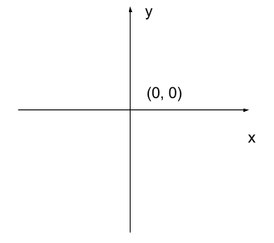
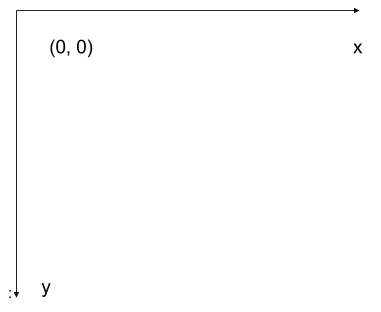

:::::::::::::::::::::::::::::::::::::: questions

- What is a digital image?
- What is a pixel?
- What does bit depth mean?
- Why is metadata important?

::::::::::::::::::::::::::::::::::::::::::::::::

::::::::::::::::::::::::::::::::::::: objectives

- Describe images as numerical arrays.
- Explain pixel intensities.
- Compare common image bit depths.
- Interpret simple intensity histograms.
- Understand why metadata are essential for microscopy.

::::::::::::::::::::::::::::::::::::::::::::::::

## Introduction

Digital microscopy images are fundamentally collections of quantitative measurements.

Although we often think of images as pictures, computers store images as
abstractions of numerical arrays. These are only approximations of what we see 
with our eyes in the real world. Before we begin to learn how to process images 
with image processing programs, we need to spend some time understanding how 
these abstractions work. Each element of the array corresponds to a single pixel and
contains an intensity value measured by a detector. Detectors produce numbers. Therefore, 
an image is nothing more than an array of numbers.  
Because you have a strong intuition of how to operate on numbers - add, subtract, multiply 
and divide, it helps to think of images as numbers instead of pictures. If you look 
at the image, your eyes may deceive you, but if you look at the numbers that make the image, 
you see the data. 

Throughout this lesson we will treat images as scientific data rather than as
illustrations, or pictures.

## Images as Arrays

We can create an image by creating a matrix. Consider the following R matrix:

```{r cache = TRUE}
img <- matrix(
  c(
    0, 20, 40,
    80, 120, 160,
    200, 220, 255
  ),
  nrow = 3,
  byrow = TRUE
)

img
```


Every number represents the intensity of one pixel.

::::::::::::::::::::::::::::::::::::::::: callout

### Matrices, arrays, images and pixels

A matrix is a mathematical concept - numbers evenly arranged in a rectangle. 
This can be a two-dimensional rectangle, like the shape of the screen you're looking at now. 
Or it could be a three-dimensional equivalent, a cuboid, or have even more dimensions, 
but always keeping the evenly spaced arrangement of numbers. 
In computing, an array refers to a structure in the computer's memory 
where data is stored in evenly spaced elements. This is strongly analogous to a matrix. 
An R matrix is a type of variable (an example of a simple type is an integer). 
For our purposes, the distinction between matrices and arrays is not important, 
we don't really care how the computer arranges our data in its memory. 
The important thing is that the computer stores values describing the pixels in images, as arrays. 
We will use the terms matrix and array interchangeably.

::::::::::::::::::::::::::::::::::::::::::::::::::

## Viewing an Image in R

Base R has a default method `image()` that can be used to display images. It takes a matrix 
and uses the x and y indices to create the image dimensions, and the value at each x,y position 
as the intensity or measurement at that location. Copy/paste or retype the command below 
into a cell in your notebook. Run it. You should see an image. By default, `image()`
assigns colors according to a reversed, 12-color "YlOrRd" (Yellow-Orange-Red) palette 
generated via the hcl.colors() function. The `col=gray.colors(256)` changes the default behaviour 
to assign gray values between black adn white to the values in the matrix. Try leaving out the `col` 
argument to see what happens. 

```{r}
image(
  img,
  col=gray.colors(256)
)
```


## Why Coordinates Matter

When we displayed our image using:

```r
image(
  img,
  col = gray.colors(256),
  axes = FALSE
)
```

you may have noticed something surprising.

The pixel value at `img[1,1]` doesn't appear in the top-left corner of the plot.

Many learners expect it to appear in the upper-left corner.

Why?

The answer is that different fields use different coordinate systems.

### Cartesian Coordinates

The base R function `image()` is derived from mathematical plotting tools.

Mathematics typically uses Cartesian coordinates:


{alt="Cartesian coordinate axes"}

In this system, a plane is divided into 4 quadrants and the origin is located in the center.

As a result, `image()` displays matrices as mathematical surfaces rather than as photographs, 

and our image of the img object is plotted in quadrant I of a cartesian coordinate system. 

### Image Coordinates

BioImage-processing software uses image coordinates that differ from the cartesian 
coordinate system. 

Examples include:

- Fiji/ImageJ
- napari
- Ilastik
- QuPath
- microscope acquisition software

In these systems the origin is located in the upper-left corner.

{alt="Image coordinate axes"}

Rows increase as you move downward through the image.

Columns increase as you move to the right. The origin is in the upper-left corner.

### Comparing the Two Systems

Suppose we create:

```{r cache = TRUE}
img2 <- matrix(
  c(
    1, 2, 3,
    4, 5, 6,
    7, 8, 9
  ),
  nrow = 3,
  byrow = TRUE
)

img2
```

Most image analysis users would interpret this matrix as:

```text
1 2 3
4 5 6
7 8 9
```

with the value `1` appearing in the upper-left corner.

However:

```{r}
image(
  1:nrow(img2),
  1:ncol(img2),
  img2,
  col = gray.colors(9),
  axes = FALSE
)

coords <- expand.grid(x = 1:nrow(img2), y = 1:ncol(img2))

text(coords$x, coords$y, labels = img2[as.matrix(coords)])
```


displays the value `1` in the lower-left corner. 

The image has not changed. Only the coordinate system used for displaying it has changed.  

If you have dark mode on, the image intensities will have been further changed by a dark 
mode filter that inverts the *display* colors before it renders them in HTML.

::::::::::::::::::::::::::::::::::::: challenge

Predict where the value

```r
img[3,3]
```

will appear in the plot generated by:

```r
image(img2)
```

Will it appear in the:

1. Upper-left
2. Upper-right
3. Lower-left
4. Lower-right

:::::::::::::::::::::::: solution

The correct answer is:

```text
2. Upper-right
```

The image() function interprets a matrix as a mathematical surface rather than as a digital image. As a result, matrix rows and columns do not map directly onto image x and y coordinates in the way most microscopy software displays images. In addition, the vertical axis increases upward, following Cartesian plotting conventions rather than image-processing conventions. To find out more about the image function, type  `?image()` in a cell and run it. You should get a description of functions, its arguments and some examples. 

:::::::::::::::::::::::::::::::::

::::::::::::::::::::::::::::::::::::::::::::::::

::::::::::::::::::::::::::::::::::::: callout

## A Common Source of Confusion

When working with image analysis software, always check which coordinate system
is being used.

A segmentation algorithm may report coordinates in image space while a plotting
function displays the same data using Cartesian coordinates.

Many bugs in image-analysis workflows arise from accidentally mixing coordinate
systems.


### Why We Are Keeping This Behaviour

You may wonder why we do not simply "fix" the orientation.

The reason is educational.

Throughout this lesson we want to emphasise that:

- images are numerical data
- image displays are visual representations of those data
- the same image can be displayed using different coordinate systems

Understanding this distinction will make later lessons on segmentation,
measurements, and image metadata much easier.

### Looking Ahead

In the next lesson we will begin working with real microscopy images using
EBImage.

Image-analysis libraries generally display data in a way that is more familiar
to microscopy users.

However, it is still important to understand what is happening underneath the
display.

The image displayed is simply a visual representation of the matrix.

::::::::::::::::::::::::::::::::::::::::::::::::

## Pixels

A pixel is a **picture element**.

Pixels have:

- a location
- an intensity value

Pixels do not have a physical size until calibration metadata are applied.

## Image Dimensions

Many microscopy datasets contain more than two dimensions.

Examples include:

```text
X Y Z
```

or:

```text
X Y Channel
```

Advanced microscopy data may contain:

```text
X Y Z Channel Time
```

This is often abbreviated:

```text
XYZCT
```

## Bit Depth

Bit depth determines the range of intensity values available.

| Bit Depth | Values |
| ---------- | ---------- |
| 8-bit | 0-255 |
| 12-bit | 0-4095 |
| 16-bit | 0-65535 |

Greater bit depth generally provides greater dynamic range and more accurate
quantitative measurements.


## Simulating Pixel Intensities

```{r}
set.seed(123)

pixels <- runif(
  10000,
  min = 0,
  max = 65535
)

pxl <- matrix(pixels, nrow = 100)

image(
  pxl, 
  col = gray.colors(256),
  axes = FALSE
)

hist(
  pixels,
  breaks = 50,
  main = "Pixel Intensity Histogram",
  xlab = "Intensity"
)
```

Histograms are one of the most useful diagnostic tools in bioimage analysis.
We'll spend time learning about historams in lesson 3.

They allow us to inspect:

- dynamic range
- saturation
- clipping
- image quality

::::::::::::::::::::::::::::::::::::: challenge

The photo-physical process of fluorescence generates image data that are derived from 
a Poisson distribution. Generate 10,000 intensity values from a poisson distribution with a $\lambda$ of 128.

display an image and a histogram of the data

:::::::::::::::::::::::: solution

```{r}
pixels_poisson <- rpois(
  10000,
  lambda = 128
)

pois_mat <- matrix(pixels_poisson, nrow = 100)

image(
  pois_mat,
  col = gray.colors(256),
  axes = FALSE
)


hist(
  pixels_poisson,
  breaks = 25
)
```

:::::::::::::::::::::::::::::::::

::::::::::::::::::::::::::::::::::::::::::::::::

## Metadata

Metadata are data describing how an image was acquired.

Examples include:

- microscope type
- objective lens
- exposure time
- detector gain
- laser power
- pixel size

::::::::::::::::::::::::::::::::::::: callout

## Metadata Are Scientific Data

Without metadata it may be impossible to reproduce a microscopy experiment or
make valid quantitative measurements.

::::::::::::::::::::::::::::::::::::::::::::::::

## Why Pixel Size Matters

Suppose a nucleus occupies:

```text
5000 pixels
```

in two different images.

Image A:

```text
Pixel size = 1 µm
```

Image B:

```text
Pixel size = 0.1 µm
```

The real-world size represented by those 5000 pixels is extremely different.

Pixel counts alone are not enough.

## Practical Exercise

Generate a random image:

```{r}
random_img <- matrix(
  runif(10000),
  nrow = 100
)

image(
  random_img,
  col = gray.colors(256),
  axes = FALSE
)
```

Calculate:

```{r}
dim(random_img)

min(random_img)

max(random_img)

mean(random_img)
```

## Discussion

Why might two images look similar on screen but not be directly comparable for
quantitative analysis?

Consider:

- exposure time
- detector gain
- pixel size
- display settings

## Quiz

::::::::::::::::::::::::::::::::::::: challenge

Which statement is TRUE?

1. Metadata are optional.
2. Images are stored as numerical arrays.
3. Pixels always represent physical units.
4. Histograms only apply to photographs.

:::::::::::::::::::::::: solution

2. Images are stored as numerical arrays.

:::::::::::::::::::::::::::::::::

::::::::::::::::::::::::::::::::::::::::::::::::

::::::::::::::::::::::::::::::::::::: challenge

A 16-bit image can represent how many intensity values?

1. 255
2. 4096
3. 65536
4. Unlimited

:::::::::::::::::::::::: solution

3. 65536

:::::::::::::::::::::::::::::::::

::::::::::::::::::::::::::::::::::::::::::::::::


## Key Points

::::::::::::::::::::::::::::::::::::: keypoints

- Digital images are numerical arrays.
- Pixels are the smallest units of an image.
- Image displays may use different coordinate systems from image-analysis software.
- Pixel values represent measured intensity.
- Bit depth determines the available intensity range.
- Histograms provide useful information about image quality.
- Metadata are essential for quantitative microscopy.
- Microscopy images should be treated as scientific datasets.

::::::::::::::::::::::::::::::::::::::::::::::::
