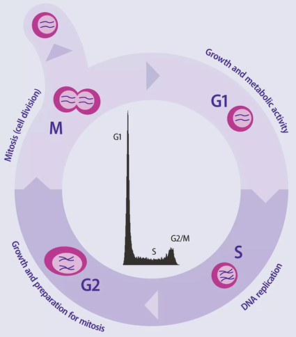

:::::::::::::::::::::::::::::::::::::: questions

- How can segmented objects be measured?
- What properties can be measured from biological objects?
- How can fluorescence intensity be quantified?
- How can image measurements be organised as tidy data?
- How can a measurement workflow be applied to multiple images?

::::::::::::::::::::::::::::::::::::::::::::::::

::::::::::::::::::::::::::::::::::::: objectives

- Measure properties of segmented biological objects.
- Count segmented nuclei.
- Calculate shape measurements.
- Organise measurements as tidy data.
- Visualise measurements using ggplot2.
- Apply the same measurement workflow to multiple images.
- Export measurements for downstream analysis.

::::::::::::::::::::::::::::::::::::::::::::::::

## Introduction

In the previous lessons we learned how to:

```text
Read Images
     ↓
Enhance Images
     ↓
Segment Objects
     ↓
Refine Segmentations
```

The goal of image analysis is usually not to create better images or refine masks.

Instead, the goal is to generate quantitative measurements that can be used to
answer biological questions.

In this lesson we will measure properties of segmented nuclei and convert image
data into a table of measurements that can be analysed using the broader R
ecosystem.

::::::::::::::::::::::::::::::::::::: callout

## From Images to Data to visualisation

Image Segmentation identifies objects.

Measurement converts those objects into quantitative data tables;

Graphs of the talbes convey biological meaning.


::::::::::::::::::::::::::::::::::::::::::::::::

## Reading the Image Stack and Recap of the previous lessons

Load the required packages.

```{r}
library(EBImage)
library(ggplot2)
```

Load the nuclei image supplied with EBImage.

```{r}
img <- readImage(
  system.file(
    "images",
    "nuclei.tif",
    package = "EBImage"
  )
)
```

Inspect the dimensions.

```{r}
dim(img)
```

The image contains four frames.

Display all four images.

```{r}
display(img, all = TRUE)
```

## Starting With One Image

To understand the workflow, we will first analyse a single frame.

Extract the first image.

```{r}
nuclei <- img[,,1]
```

Display the image.

```{r}
display(nuclei)
```

## Segmenting the Nuclei

Create a binary mask.

```{r}
mask <- nuclei > 0.2
```

Display the mask.

```{r}
display(mask)
```

Apply a small amount of morphological cleanup.

```{r}
mask <- opening(
  mask,
  makeBrush(
    size = 5,
    shape = "disc"
  )
)
```

Create a distance map.

```{r}
dmap <- distmap(mask)
```

Separate touching nuclei using watershed segmentation.

```{r}
labels <- watershed(dmap)
```

Display the labelled objects.

```{r}
display(
  colorLabels(labels)
)
```

Each segmented nucleus has now been assigned a unique label.

## Measuring Objects

The simplest measurement is object count.

```{r}
max(labels)
```

Each label corresponds to a segmented object.


## Measuring Object Shape

EBImage can calculate a variety of shape measurements.

```{r}
shape_features <- computeFeatures.shape(
  labels
)
```

Inspect the first few measurements.

```{r}
head(shape_features)
```

Each row represents a nucleus.

Each column represents a measurement.

## Creating Tidy Data

Many R packages work most naturally with data frames.

Create a data frame of the measurements.

```{r}
shape_df <- as.data.frame(
  computeFeatures.shape(labels)
)
```

Inspect the data.

```{r}
head(shape_df)
```

Each row represents a single nucleus.

Each column represents a single measurement.

This follows the principles of tidy data:

- each row represents one observation
- each column represents one variable
- each cell contains one value


::::::::::::::::::::::::::::::::::::: callout

## Image Analysis Produces Tidy Data

A common goal of image analysis is to transform image pixels into structured
datasets that can be analysed using standard statistical and visualisation
tools.

::::::::::::::::::::::::::::::::::::::::::::::::

## Measuring Nuclear Area

Area is often one of the most important biological measurements.

Inspect the area measurement.

```{r}
head(
  shape_df$s.area
)
```

Area is reported in pixels.


## Visualising Nuclear Areas

Create a histogram of nuclear areas.

```{r}
ggplot(
  shape_df,
  aes(x = s.area)
) +
  geom_histogram(
    bins = 20
  ) +
  labs(
    title = "Distribution of Nuclear Areas",
    x = "Area (pixels)",
    y = "Count"
  )
```

The histogram summarises the distribution of nucleus sizes within the image.

Notice that we are no longer visualising an image.

Instead, we are visualising measurements extracted from biological objects.

## Exploring Shape Measurements

Nuclei can be described using many measurements.

For example, we can compare object area and perimeter.

```{r}
ggplot(
  shape_df,
  aes(
    x = s.area,
    y = s.perimeter
  )
) +
  geom_point() +
  labs(
    x = "Area (pixels)",
    y = "Perimeter (pixels)"
  )
```

Each point represents a single nucleus. We might use either of the graphs above 
to filter the data to remove objects that are too small to be nuclei or 
are too big and likely to be merged objects.

Perhaps something like this:

```{r}
library(tidyverse) 

filtered_df <- shape_df |>
  filter(s.area > 250 & s.area < 1000)

```


## Measuring Intensity

Object shape is not the only quantity that can be measured.

We can also measure pixel intensities inside each segmented nucleus.

Calculate intensity measurements.

```{r}
intensity_features <- as.data.frame(
  computeFeatures.basic(
    labels,
    nuclei
  )
)
```

Inspect the results.

```{r}
head(intensity_features)
```

## Mean Intensity

One useful measurement is mean intensity.

```{r}
head(
  intensity_features$b.mean
)
```

Mean intensity describes the average signal within a nucleus.

::::::::::::::::::::::::::::::::::::: challenge

Which nucleus has the stronger fluorescence signal?

```text
Nucleus A = 0.21

Nucleus B = 0.38
```

:::::::::::::::::::::::: solution

```text
Nucleus B
```

The larger mean intensity indicates a stronger signal.

:::::::::::::::::::::::::::::::::

::::::::::::::::::::::::::::::::::::::::::::::::

## Combining Measurements

Combine shape and intensity measurements.

```{r}
features_df <- cbind(
  shape_df,
  intensity_features
)
```

Inspect the combined table.

```{r}
head(features_df)
```

Each row represents a nucleus.

The columns now contain both:

- shape measurements
- intensity measurements

## Exploring Relationships Between Measurements

Compare area and mean intensity.

```{r}
ggplot(
  features_df,
  aes(
    x = s.area,
    y = b.mean
  )
) +
  geom_point() +
  labs(
    x = "Area (pixels)",
    y = "Mean Intensity"
  )
```

Plots such as this can help identify biological relationships between
measurements.

::::::::::::::::::::::::::::::::::::: callout

## Images Become Data

At this stage of the workflow we are no longer analysing images directly.

We are analysing measurements extracted from biological objects.

::::::::::::::::::::::::::::::::::::::::::::::::

## Visualising Nuclear Intensity Measurements

Earlier we measured the mean intensity of each segmented nucleus.

We can visualise those measurements using a histogram.

```{r}
ggplot(
  features_df,
  aes(x = b.mean)
) +
  geom_histogram(
    bins = 15
  ) +
  labs(
    title = "Distribution of Mean Nuclear Intensities",
    x = "Mean Intensity",
    y = "Count"
  )
```

The histogram summarises the intensity measurements for every segmented nucleus.

Notice that not all nuclei have the same intensity.

Some nuclei have relatively low mean intensities, while others have
substantially higher values.

This variation is often referred to as **biological heterogeneity**.

::::::::::::::::::::::::::::::::::::: callout

## Biological Variation

Image analysis allows us to quantify differences between individual cells.

Rather than simply observing that cells "look different", we can measure and
visualise those differences quantitatively.

::::::::::::::::::::::::::::::::::::::::::::::::

## From Measurements to Biological Insight

The image analysed in this lesson is not intended for cell-cycle analysis.

However, similar measurements are widely used in biological research.

For example, consider a fluorescence image in which DNA has been stained with a
DNA-binding dye.

Cells in different phases of the cell cycle often contain different amounts of
DNA:

```text
G1 Phase
    ↓
Lower DNA Content

S Phase
    ↓
DNA Replication

G2 Phase
    ↓
Higher DNA Content
```

If fluorescence intensity is proportional to DNA content, a histogram of
nuclear intensities may reveal distinct populations of cells. 
This is very common in flow cytometry measurements.

{alt="cell cycle DNA content Vs Cell Number"}

In an experiment designed to measure DNA content, such a distribution could be
used to investigate:

- cell-cycle progression
- responses to drug treatment
- changes in cellular physiology
- differences between biological conditions

The important idea is not the specific biological interpretation.

The important idea is that image analysis transforms images into measurements,
and measurements can generate biological insight.

::::::::::::::::::::::::::::::::::::: challenge

Why is a histogram often more informative than simply looking at the original
image?

:::::::::::::::::::::::: solution

The image allows us to see individual nuclei, but it can be difficult to judge
overall patterns by eye.

A histogram summarises measurements across many objects simultaneously and can
reveal trends, variation, and potentially distinct biological populations.

:::::::::::::::::::::::::::::::::

::::::::::::::::::::::::::::::::::::::::::::::::

## Quantitative Biology

Earlier in the course we focused on images.

Now we are beginning to focus on measurements.

This transition is one of the most powerful aspects of bioimage analysis.

Conceptually:

```text
Image
   ↓
Segmentation
   ↓
Objects
   ↓
Measurements
   ↓
Biological Interpretation
```

The measurements extracted from images can be analysed using many of the same
approaches used for other biological datasets, including:

- summary statistics
- hypothesis testing
- data visualisation
- modelling

Images provide the raw information.

Measurements allow us to answer biological questions.

## Applying the Workflow to Multiple Images

So far we have analysed only one frame.

However, the image stack contains four frames.

One of the advantages of scripted image analysis is that the same workflow can
be applied repeatedly.

Conceptually:

```text
Image 1
Image 2
Image 3
Image 4
      ↓
Same Workflow
      ↓
One Dataset
```

## Creating a Measurement Function

Create a function that performs segmentation and measurement.

```{r}
measure_nuclei <- function(image, frame_id) {

  mask <- image > 0.2

  mask <- opening(
    mask,
    makeBrush(
      size = 5,
      shape = "disc"
    )
  )

  labels <- watershed(
    distmap(mask)
  )

  shape_df <- as.data.frame(
    computeFeatures.shape(labels)
  )

  shape_df$frame <- frame_id

  shape_df
}
```

Apply the function to the first image to validate functionality.

```{r}
measure_nuclei(
  img[,,1],
  frame_id = 1
)
```

## Measuring Every Frame

The image stack contains four images.

Rather than analysing each image manually, we can repeat the same workflow for
every frame.

Create an empty data frame to store the results.

```{r}
all_measurements <- data.frame()
```

Loop through each frame in the image stack.

```{r}
for (i in seq_len(numberOfFrames(img))) {

  frame_measurements <- measure_nuclei(
    img[,,i],
    frame_id = i
  )

  all_measurements <- rbind(
    all_measurements,
    frame_measurements
  )

}
```

Inspect the first few rows.

```{r}
head(all_measurements)
```

The resulting data frame contains measurements from all four images.

Each row represents a nucleus.

The `frame` column records which image the nucleus originated from.

## Comparing Measurements from different images

Create a boxplot of nuclear areas by frame.

```{r}
ggplot(
  all_measurements,
  aes(
    x = factor(frame),
    y = s.area
  )
) +
  geom_boxplot() +
  labs(
    x = "Frame",
    y = "Area (pixels)",
    title = "Nuclear Areas Across Frames"
  )
```

A single workflow has now produced measurements from four separate images.

::::::::::::::::::::::::::::::::::::: challenge

What does each box represent in the plot above?

:::::::::::::::::::::::: solution

Each box summarises the distribution of nuclear areas detected in one frame of
the image stack.

:::::::::::::::::::::::::::::::::

::::::::::::::::::::::::::::::::::::::::::::::::

## Exporting Measurements

Measurement tables can be exported for downstream analysis.

```{r eval = FALSE}
write.csv(
  all_measurements,
  "nuclei_measurements.csv",
  row.names = FALSE
)
```

The resulting file can be combined with other experimental data or analysed
using statistical methods.

::::::::::::::::::::::::::::::::::::: callout

## Reproducible Analysis

Once a workflow has been written, it can be applied consistently to many images.

This improves reproducibility and reduces manual effort.

::::::::::::::::::::::::::::::::::::::::::::::::

## Looking Ahead

We have now completed a complete image-analysis workflow:

```text
Image
   ↓
Segmentation
   ↓
Object Identification
   ↓
Measurement
   ↓
Tidy Data
   ↓
Visualisation
```

The ability to transform images into reproducible datasets is one of the most
powerful aspects of quantitative bioimage analysis.

## Key Points

::::::::::::::::::::::::::::::::::::: keypoints

- Segmentation enables object-based measurements.
- Shape and intensity features can be calculated from segmented objects.
- Measurements can be converted into tidy data frames.
- Each object corresponds to a row in a measurement table.
- Histograms and scatter plots can be used to explore measurements.
- ggplot2 can visualise measurements extracted from images.
- Functions allow measurement workflows to be applied repeatedly.
- The same workflow can be applied to multiple images.
- Image analysis transforms biological images into quantitative data.

::::::::::::::::::::::::::::::::::::::::::::::::
