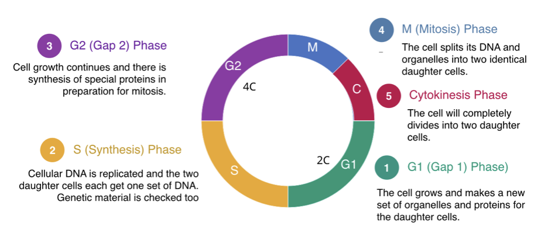

:::::::::::::::::::::::::::::::::::::: questions

- How can DNA content be measured from microscopy images?
- How can image-analysis measurements reveal cell-cycle state?
- How do different treatments affect cell-cycle progression?
- How can reproducible workflows be applied to many images?

::::::::::::::::::::::::::::::::::::::::::::::::

::::::::::::::::::::::::::::::::::::: objectives

- Apply an image-analysis workflow to multiple microscopy images.
- Measure integrated nuclear DAPI intensity.
- Organise image-analysis output as tidy data.
- Generate DNA-content histograms.
- Assign nuclei to cell-cycle phases.
- Compare cell-cycle distributions between treatments.
- Understand how image analysis can generate biological insight.

::::::::::::::::::::::::::::::::::::::::::::::::

## Introduction

Throughout this course we have developed a quantitative image-analysis
workflow.

We learned how to:

```text
Read Images
      ↓
Segment Objects
      ↓
Measure Features
      ↓
Create Tidy Data
```

Image analysis becomes particularly powerful when measurements can be linked to
a biological question.

In this lesson we will analyse fluorescence microscopy images of DAPI-stained
nuclei and use the measured nuclear DNA content to investigate cell-cycle
distribution.

This approach is based on a published workflow in which integrated nuclear DAPI
intensity was used as a proxy for DNA content and cell-cycle state. Cells were
treated with compounds known to perturb cell-cycle progression, and the
resulting DNA-content distributions were compared between treatments.

::::::::::::::::::::::::::::::::::::: callout

## Biological Question

Different drugs can cause cells to accumulate in different stages of the cell
cycle.

Can we detect those changes using only microscopy images and image analysis?

::::::::::::::::::::::::::::::::::::::::::::::::

## The Treatments

The drugs used in this experiment are expected to perturb cell-cycle progression in different ways. 

- **Aphidicolin** inhibits DNA polymerase activity and prevents efficient DNA replication, 
causing cells to accumulate at the G1/S boundary or within early S phase. 

- **Camptothecin** induces DNA damage by inhibiting topoisomerase I, 
leading to replication stress and slowing the progression of cells through S phase. 

- **Etoposide** inhibits topoisomerase II and generates DNA double-strand breaks, 
activating DNA-damage checkpoints and frequently causing cells to accumulate in G2/M. 

- **untreated** (control) cells should be distributed across all stages of the cell cycle.


Consequently, we would predict the DNA-content histograms of the treated populations to differ from the untreated control, 
reflecting the specific effects of each drug on cell-cycle progression.

## The Dataset

The dataset contains DAPI-stained nuclei from untreated cells and cells treated
with three different compounds:

```text
Untreated
Aphidicolin
Camptothecin
Etoposide
```

The image filenames contain the treatment information.

Examples:

```text
DAPI_untreated01_R3D.ome.tif
DAPI_untreated02_R3D.ome.tif

DAPI_aphidicolin01_R3D.ome.tif
DAPI_aphidicolin02_R3D.ome.tif

DAPI_camptothecin01_R3D.ome.tif
DAPI_camptothecin02_R3D.ome.tif

DAPI_etoposide01_R3D.ome.tif
DAPI_etoposide02_R3D.ome.tif
```

Rather than analysing files manually, we will create a workflow that discovers
and processes all images automatically. First we develop the workflow step-by-step, 
iteratively, tesing on one image. Then we create a function that incorporates
each of the individual steps of the workdflow, for reproducibility. 
We finally apply the function to all the images in our dataset to create metrics that could
support our hypothesis.

## Listing the Image Files

The first step is to load the libraries we will need and then create a list of the image
files that we can loop over and process them one after another. 

```{r}
library(EBImage)
library(tidyverse)

files <- list.files(
  "data/11-cell-cycle-analysis",
  pattern = "\\.ome.tif$",
  full.names = TRUE
)

files
```

This approach is flexible and reproducible.

If additional images are added later, the analysis will automatically include
them.

::::::::::::::::::::::::::::::::::::: challenge

Why is it preferable to generate a file list automatically rather than typing
individual filenames into a script?

:::::::::::::::::::::::: solution

Automatically generating a file list:

- reduces typing errors
- accommodates changing datasets
- improves reproducibility
- requires less maintenance

:::::::::::::::::::::::::::::::::

::::::::::::::::::::::::::::::::::::::::::::::::

## DNA Content and the Cell Cycle

The amount of DNA present in a cell changes as the cell progresses through the
cell cycle.

{alt="cell cycle depiction using a circular path."}

```text
G1 Phase (2C)
     ↓
S Phase (> 2C < 4C)
     ↓
G2/M Phase (4C -> 2C)
```

If DAPI staining is proportional to DNA content, then the integrated DAPI
intensity of a nucleus can be used as an estimate of DNA abundance and that will
tell us which phase of the cell cycle that nucleus is in.

## Reading and Segmenting an Image

Read a single file into an EBImage `Image` object.

```{r}
img <- readImage(files[1])
```

Display the image. These images are from a widefield microscope with a 10x/0.4NA lens.
The camera used was a 12-bit camera, producing data with 4096 gray levels. 
Computers allocate memory in bytes (1-byte = 8-bits). Therefore, a 12-bit 
image has pixel data that are too large to be stored in a single byte 
but the largest intensity value (4095) is only 6% of the total range that could be 
stored in a 2-byte pixel (65,536 intensity values). Consequently, we store them
in a 16-bit file format and when EBImage reads them into memory and converts the 
integers into the range between 0 and 1, the largest possible value is 0.0624856.
This leads to images that are very dark when displayed on the screen, unless we 
change the display. We could set the `inputRange` in the normalize function so that the 
min is 0 and the max = 4095, but I used the min and max from the image. Remember, 
these are not the values that will be used for calculations. 

```{r}
display(normalize(img, inputRange = c(min(img), max(img))))
```

Segment the nuclei.

```{r}
mask <- img > otsu(img)

mask <- opening(
  mask,
  makeBrush(
    size = 5,
    shape = "disc"
  )
)
mask <- fillHull(mask)

labels <- watershed(
  distmap(mask)
)
```

## Why Use Otsu's Thresholding Method?

So far in this course we have often selected threshold values manually. While
this can be useful for learning and exploration, manually chosen thresholds can
introduce subjectivity and make analyses difficult to reproduce.

To improve reproducibility, we will use **Otsu's thresholding method**, an
automatic threshold-selection algorithm. Rather than requiring the user to
choose a threshold value, Otsu's method examines the image histogram and
identifies the threshold that best separates pixels into two groups:
foreground and background.

Conceptually:

```text
Pixel Intensities
        ↓
   Histogram
        ↓
Find Threshold That Best Separates
Background and Foreground Pixels
        ↓
Binary Mask
```
The method works by identifying the threshold that maximises the difference between 
the two pixel populations while minimising the variation within each group. 
When an image contains a distinct foreground population of bright pixels against a darker background, 
Otsu's method often produces a robust and objective threshold.

In this lesson, the exact threshold chosen for each image will be determined 
automatically from the image data rather than by the user. 
This means that the same workflow can be applied consistently across many 
images and by different researchers, helping to ensure that the analysis is reproducible.

Like all segmentation methods, Otsu's thresholding is not perfect and may 
not perform well if foreground and background intensities overlap substantially. 
Nevertheless, it provides a widely used, objective starting point for image 
segmentation and is often preferred over manually selected thresholds when 
building reproducible image-analysis workflows.


Display the segmented nuclei.


```{r}
display(
  colorLabels(labels)
)
```


## Measuring Integrated DAPI Intensity

The key measurement we need to extract from each nuclear object is the integrated nuclear
DAPI intensity. We cannot compute the integrated nuclear intensity directly using
functions provided by `EBImage`. Instead we must calculate the mean object intensity, 
using EBImages `computeFeatures.basic()` function and the object size using the 
`computeFeatures.shape()` function. We can then multiply the `s.area` & `b.mean` columns 
to get the integrated intensity of each object.

Calculate the shape and basic intensity measurements. Combine these into a features table.

```{r}
basic_features <- as.data.frame(
  computeFeatures.basic(
    labels,
    img
  )
)
shape_features <- as.data.frame(
  computeFeatures.shape(
    labels
  )
)

features <- cbind(basic_features, shape_features)

# Add a new column derived by multiplying the mean intensity by the area.

features <- features |>
  mutate( integrated_intensity = b.mean * s.area)

#features$integrated_intensity <- features$b.mean * features$s.area
```

Inspect the measurements.

```{r}
head(features)
```

Integrated intensity is the sum of all pixel intensities inside a nucleus.

Conceptually:

```text
DNA Content
      ↓
Integrated DAPI Intensity
```

Unlike mean intensity, integrated intensity depends on both:

- nuclear size
- nuclear fluorescence intensity

## Visualising DNA Content

Create a histogram of integrated intensity values.

```{r}
library(ggplot2)

ggplot(
  features,
  aes(x = integrated_intensity)
) +
  geom_histogram(
    bins = 50
  ) +
  labs(
    x = "Integrated DAPI Intensity",
    y = "Number of Nuclei",
    title = "DNA Content Distribution"
  )
```

Each bar represents nuclei with similar DNA content.

::::::::::::::::::::::::::::::::::::: challenge

What does each observation in this histogram represent?

:::::::::::::::::::::::: solution

Each observation corresponds to one nucleus and its measured integrated DAPI
intensity.

:::::::::::::::::::::::::::::::::

::::::::::::::::::::::::::::::::::::::::::::::::

## Creating a Reproducible Workflow

The same analysis must be applied to every image.

Rather than copying and pasting code repeatedly, we'll create a function.

```{r}
measure_dna_content <- function(image_file) {

  img <- readImage(image_file)

  mask <- img > otsu(img)

  mask <- opening(
    mask,
    makeBrush(
      size = 5,
      shape = "disc"
    )
  )
  
  mask <- fillHull(mask)
  
  labels <- watershed(
    distmap(mask)
  )

  basic_features <- as.data.frame(
    computeFeatures.basic(
      labels,
      img
    )
  )

  shape_features <- as.data.frame(
    computeFeatures.shape(
      labels
    )
  )
  
  features <- cbind(basic_features, shape_features)

  features <- features |>
  mutate( integrated_intensity = b.mean * s.area)
  
  features

}
```

Apply the function to one image to ensure it does what we think it does.

```{r}
measure_dna_content(
  files[1]
)
```

::::::::::::::::::::::::::::::::::::: callout

## Reproducibility

Functions help ensure that every image is processed using exactly the same
workflow and parameters.

::::::::::::::::::::::::::::::::::::::::::::::::

## Extracting Treatment Information

The treatment name is encoded within each filename.

For example:

```text
DAPI_etoposide01_R3D.ome.tif
```

contains:

```text
etoposide
```

Extract the treatment name.

```{r}
example_file <- basename(files[1])

str_extract(
  example_file,
  "(?<=DAPI_)[A-Za-z]+(?=[0-9])"
)
```

we will use the same approach throughout the analysis.

## Measuring All Images

Create an empty data frame.

```{r}
all_measurements <- data.frame()
```

Process every image.

```{r}
for (file in files) {

  measurements <- measure_dna_content(file) |>
    mutate(
      image = basename(file),
      treatment = str_extract(
        image,
        "(?<=DAPI_)[A-Za-z]+(?=[0-9])"
      )
    )

  all_measurements <- rbind(
    all_measurements,
    measurements
  )
}
```

Inspect the results.

```{r}
head(all_measurements)
```

Each row corresponds to a single nucleus.

::::::::::::::::::::::::::::::::::::: callout

## Tidy Data

Each row represents one nucleus.

Each column represents one measured variable.

This structure makes downstream analysis straightforward.

::::::::::::::::::::::::::::::::::::::::::::::::

## DNA Content Histograms by Treatment

Visualise the DNA-content distributions.

```{r}
ggplot(
  all_measurements,
  aes(x = integrated_intensity)
) +
  geom_histogram(
    bins = 50
  ) +
  facet_wrap(
    ~ treatment,
    scales = "free_y"
  ) +
  labs(
    x = "Integrated DAPI Intensity",
    y = "Number of Nuclei"
  )
```

Each panel represents one treatment condition.

::::::::::::::::::::::::::::::::::::: challenge

Why might different treatments produce different DNA-content histograms?

:::::::::::::::::::::::: solution

Some treatments alter cell-cycle progression.

As cells accumulate in particular cell-cycle stages, the distribution of DNA
content changes.

:::::::::::::::::::::::::::::::::

::::::::::::::::::::::::::::::::::::::::::::::::

## Defining Cell-Cycle Gates

Cell-cycle phase can be estimated from DNA content.

Conceptually:

```text
Lower DNA Content
      ↓
G1

Intermediate DNA Content
      ↓
S

Higher DNA Content
      ↓
G2/M
```

The exact thresholds depend on the experiment and are typically chosen by
examining the DNA-content histogram. 【1-0cef45】

Example gates:

```{r}
all_measurements <- all_measurements |>
  mutate(
    phase = case_when(
      integrated_intensity < 6 ~ "G1",
      integrated_intensity < 10 ~ "S",
      TRUE ~ "G2/M"
    )
  )
```

Inspect the results.

```{r}
table(
  all_measurements$phase
)
```

::::::::::::::::::::::::::::::::::::: callout

## Biological Interpretation

The threshold values shown here are illustrative.

For real experiments, gates should be chosen based on the observed DNA-content
distributions.

::::::::::::::::::::::::::::::::::::::::::::::::

## Calculating Cell-Cycle Percentages

Calculate the percentage of cells in each phase.  This table is in the tidy format, 
but it's hard to see and summarise. We can also create a visually appealing summary table.

```{r}
phase_summary <- aggregate(
  integrated_intensity ~ treatment + phase,
  data = all_measurements,
  FUN = length
)

names(phase_summary)[3] <- "count"
phase_summary


```

Calculate percentages within each treatment. 

```{r}
phase_summary <- phase_summary |>
  group_by(treatment) |>
  mutate(
    percentage = 100 * count / sum(count)
  ) |>
  ungroup()

cell_cycle_table <- phase_summary |>
  select(
    treatment,
    phase,
    percentage
  ) |>
  mutate(
    treatment = ifelse(treatment == "untreated", "control",treatment),
    percentage = round(percentage, 1)
  ) |>
  pivot_wider(
    names_from = phase,
    values_from = percentage
  )

cell_cycle_table <- cell_cycle_table |>
  mutate(
    treatment = factor(
      treatment,
      levels = c(
        "control",
        "aphidicolin",
        "camptothecin",
        "etoposide"
      )
    )
  ) |>
  arrange(treatment)

cell_cycle_table
```

Inspect the summary table.

```{r}
phase_summary
```

## Visualising Cell-Cycle Distributions

Create a stacked bar chart.

```{r}
ggplot(
  phase_summary,
  aes(
    x = treatment,
    y = percentage,
    fill = phase
  )
) +
  geom_col()
```

This plot summarises the cell-cycle composition of each treatment group.

::::::::::::::::::::::::::::::::::::: challenge

If one treatment shows a larger proportion of cells in G2/M than the untreated
sample, what might this indicate?

:::::::::::::::::::::::: solution

The treatment may be delaying or arresting cells in G2/M, causing cells to
accumulate in that phase of the cell cycle.

:::::::::::::::::::::::::::::::::

::::::::::::::::::::::::::::::::::::::::::::::::

## From Images to Biological Insight

This lesson demonstrates how image analysis can answer biological questions.

Conceptually:

```text
Microscopy Images
        ↓
Segmentation
        ↓
Nuclei
        ↓
DNA Content Measurements
        ↓
Cell-Cycle Histograms
        ↓
Treatment Comparison
        ↓
Biological Interpretation
```

## A Note on Statistics

The visualisations in this lesson help us identify potential differences
between treatment groups.

In a complete analysis we would usually follow up with statistical methods to
assess whether observed differences are likely to be biologically meaningful or
could have arisen by chance.

Statistical testing is beyond the scope of this lesson, but the tidy datasets
produced here can be analysed using the full range of statistical tools
available in R.

::::::::::::::::::::::::::::::::::::: callout

## Why R?

R allows image analysis, data wrangling, visualisation, and statistical
analysis to be performed within a single reproducible workflow.

::::::::::::::::::::::::::::::::::::::::::::::::

## Looking Back

Throughout this course we have developed a complete quantitative image-analysis
workflow.


```text
Read Images
      ↓
Understand Metadata
      ↓
Visualise Images
      ↓
Understand Channels
      ↓
Enhance Images
      ↓
Segment Objects
      ↓
Apply Morphological Operations
      ↓
Measure Objects
      ↓
Generate Tidy Data
      ↓
Answer Biological Questions
```

## Key Points

::::::::::::::::::::::::::::::::::::: keypoints

- Integrated DAPI intensity can be used as a proxy for DNA content.
- DNA content measurements can be used to estimate cell-cycle state.
- Reproducible workflows apply the same analysis to every image.
- File lists allow analysis of changing datasets without modifying code.
- Measurement tables should be organised as tidy data.
- Histograms can reveal biologically meaningful cell-cycle distributions.
- Treatments can alter the proportion of cells in different cell-cycle phases.
- Image analysis transforms microscopy images into biological insight.

::::::::::::::::::::::::::::::::::::::::::::::::
